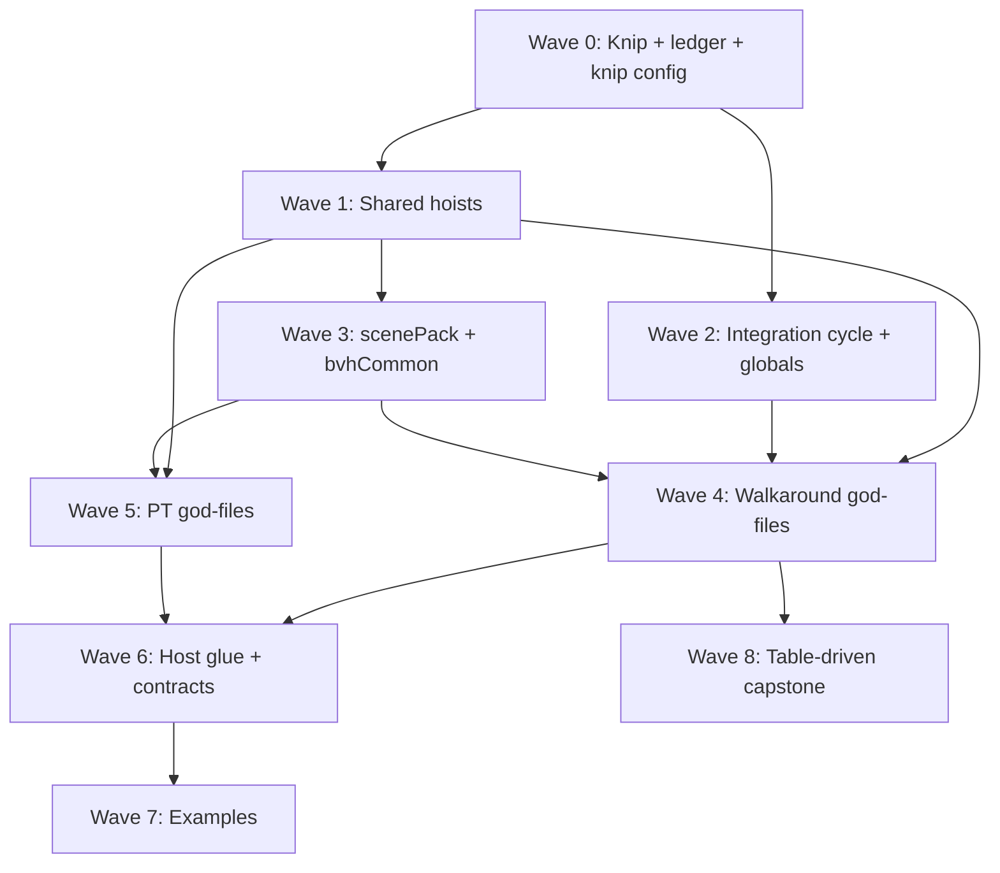

> **ARCHIVED 2026-05-30 — SUPERSEDED, never executed.** This was the pre-approval draft. The remediation that actually ran is `plan/archive/complexity-remediation-20260528-archived-2026-06-02.md` (all 13 themes landed) and the later `plan/archive/complexity-sweep-refactor-2026-05-30-archived-2026-06-02.md`. Kept for historical context only; do not treat its wave plan as the work that happened.

# Complexity remediation — full implementation plan

**Date:** 2026-05-26  
**Status:** SUPERSEDED draft (archived 2026-05-30) — was "Draft — awaiting approval"; superseded before execution by `complexity-remediation-20260528.md`.  
**Inputs:** `plan/in-flight-sweep.md` (2026-05-26 sweep, ~120+ findings), `plan/dead-code-sweep-20260518.md` (knip baseline), agent triage on HEAD  
**Out of scope:** New rendering features, npm publish, upstream PRs to `gkjohnson/three-gpu-pathtracer`  
**Relationship to shipped work:** W1–W13 premium-grade refactor and PR/WG primary-release programs are **complete on `main`**. This plan addresses **residual** structural debt from the 2026-05-26 code-only sweep, not re-opening closed workstreams unless a finding regressed.

---

## 1. Problem statement

The vitrum monorepo (~596 TypeScript files) has passed mechanical CI and primary-release signoff, but a fresh **code-only** complexity sweep found:

- **13+ god files / mixed-concern hotspots** still over 400–1500 LOC (`HybridEngine.ts`, `WalkaroundGPUPipeline.ts`, `resourceManager.ts`, `probeUpdatePass.ts`, `pt-webgpu/index.ts`, `ptEngineWebGL2.ts`, `bvhCommon.ts`, `scenePack.ts`, `vitrumSceneToThree.ts`, fork `PhysicalPathTracingMaterial.js`, example `main.ts` files).
- **Duplication** across SAH builders, WGSL intersection/kernel tiers, denoiser albedo modulate, bind-group builders, Cornell example scenes, WebGPU canvas configure.
- **Integration debt:** ddgi↔pipeline import cycle, `window.__WGPU__` / `window.__DDGI__`, promise-ledger vs runtime drift risk, pt-webgl BDPT light-subpath half-wired, fork MRT not allocated.
- **Dead-code noise:** knip reports ~43 “unused files” and ~30+ unused exports — many are **false positives** (vitest entries, fork examples, codegen, test oracles).

**Goal:** Remediate **every** sweep finding in dependency order with behavior-preserving splits where possible, explicit visual gates where not, and a corrected knip baseline so future dead code is trustworthy.

---

## 2. Approach options (choose one)

### Option A — Sequential wave program (recommended)

Nine waves (0–8): mechanical baseline → shared hoists → integration → shared BVH → walkaround god-files → PT god-files → host/contracts → examples → table-driven capstone. **Critical path:** `0 → 1 → 3 → 4 → 6 → 7`. Wave 5 (PT) parallel after wave 3.

| Pros | Cons |
|------|------|
| Matches dependency reality; audit + ref renders at safe boundaries | Calendar time ~8–12 weeks if one stream |
| Low merge conflict risk vs big-bang | Requires discipline on wave gates |

### Option B — Package-vertical slices

Complete `walkaround-hybrid` end-to-end, then `pt-webgpu`, then `pt-webgl`, then `shared-*`, then `examples/`.

| Pros | Cons |
|------|------|
| Team ownership per package | **Repeats** dedup work; `scenePack` blocks both backends — wrong order |
| | Highest risk of long-lived branches diverging on `shared-bvh` |

### Option C — Findings-only PR train (~40 micro-PRs)

One finding ≈ one PR, strict dependency labels.

| Pros | Cons |
|------|------|
| Easy review | Review fatigue; integration fixes split across PRs break compiles |
| | God-file splits become unreviewable 50-PR chains |

### Option D — Defer god-files; hygiene-only

Waves 0–2 + 7 only (knip, ledger, cycle, globals, examples).

| Pros | Cons |
|------|------|
| Fast (~2–3 weeks) | **Does not** remediate sweep mandate (“everything”) |
| | LOC debt compounds |

### Option E — Hybrid (recommended execution shape)

**Option A waves**, but **parallel worktrees** after wave 0:

- Track **H** (hybrid): waves 1–2 → 4  
- Track **P** (PT): waves 1 → 3 → 5  
- Track **S** (shared/examples): wave 0 → 1 → 3 → 6 → 7  

Merge weekly at wave boundaries with `npm run verify:mechanical`.

**Recommendation:** **Option E** (Option A ordering + parallel tracks). Option D is explicitly rejected unless the user narrows scope.

---

## 3. Dead-code triage (knip) — verdict per category

**Rule:** Nothing is deleted until grep + read confirms **A (truly dead)**. **B (unwired)** is wired, documented `@internal`, or knip-ignored. **C** = knip config fix. **D** = fork/upstream, exclude from vitrum knip.

### 3.1 Summary counts (expected after triage)

| Verdict | Action | Approx. items |
|---------|--------|----------------|
| **A** Delete or unexport | Safe removal | 5–15 |
| **B** Wire or document | Keep; add tests/docs/codegen hook | 8–12 |
| **C** Knip false positive | Fix `knip.json` entry/project | 35–45 |
| **D** Fork examples | `ignore` `three-gpu-pathtracer/example/**` | ~22 files |

### 3.2 Mandatory items (verified on HEAD)

| Item | Path | Verdict | Evidence | Action |
|------|------|---------|----------|--------|
| `fillBdptLightPathCpu` | `pt-webgpu/src/bdpt/fillBdptLightPathCpu.ts` | **B** | Zero importers; CHANGELOG: “test oracle only” | Add `bdptLightSubpathOracle.test.ts` (CPU); optional GPU readback vs oracle; **do not delete** |
| `rcParamsLayout` + `.generated.ts` | `walkaround-hybrid/src/rc/` | **B** | `tools/generate-wgsl-layouts.mjs` writes generated; `packRCParams` in `HybridEngineRC.ts` uses **manual** offsets today | **Wire** `packRCParams` to `RCParamsOffset` OR add test that generated offsets === manual pack; knip: add codegen to entry |
| `svgfRealPipelineCache` | `shared-denoisers/src/svgfRealPipelineCache.ts` | **C** | Imported by `svgfRealWebGPU.ts` | **Do not delete** (May-18 sweep was stale) |
| `percentile95` | `examples/.../prBenchHarness.ts` | **C** | Used in harness + `prBenchHarness.test.ts` | Fix examples knip entry |
| `_resetCacheUnsafe` | `core/src/gpuDetection.ts` | **B** | Exported from module, not `core/index.ts`; no test imports | Move to `gpuDetection.test-utils.ts` or drop export |
| `collectDDGIPointLightsFromRoot` | `HybridEngineLifecycle.ts` | **A** | Only called from same-file `collectDDGILightsFromRoot` | Remove `export` |
| `resolveReSTIRBvhMode` re-export | `restir/bvhCompute.ts` | **C** | Consumers import from `sceneBvhFromCore.ts` | Remove redundant re-export from `bvhCompute.ts` |
| `MOTION_VECTORS_WGSL` | `shaders/motionVectors.wgsl.ts` | **C** | `MOTION_VECTORS_MODULE` in `wgslModules.ts` | Unexport raw string or knip ignore |
| FrameResources sub-interfaces | `resourceManager.ts` | **C** | Used inside file only | Remove `export` keyword |
| `PT_WEBGPU_*` WGSL shards | `pt-webgpu/src/wgsl/**` | **C** | Composed into orchestrators; contract tests | knip `ignoreExports` pattern for `*.wgsl.ts` |
| Fork `example/*` | `three-gpu-pathtracer/example/` | **D** | Upstream demos | knip ignore |
| Vitest `__tests__/*.ts` as “unused files” | various | **C** | Run by vitest, not knip entry graph | Extend workspace `entry` in `knip.json` |
| `eslint.config.js` | root | **C** | Used by `npm run lint` | knip ignore or entry |

### 3.3 Wave 0 dead-code tasks (exhaustive checklist)

1. Update `knip.json`: entries for `tools/generate-wgsl-layouts.mjs`, `*.generated.ts`, vitest configs, `packages/three-gpu-pathtracer` (ignore `example/**` or fix vite project).
2. Re-run `npx knip --no-progress`; attach JSON to `plan/dead-code-sweep-20260527.json` (new baseline).
3. Apply all **A** removals in one commit batch (grep-gated).
4. Apply all **B** wiring (fillBdptLightPathCpu test, packRCParams/codegen alignment).
5. Reconcile `plan/dead-code-sweep-20260518.md` header with “stale items fixed”.
6. **Run `/audit` on changed packages. Fix arch issues before wave 1.**

---

## 4. Wave structure and dependencies



---

## 5. Wave 0 — Mechanical baseline

**Duration:** 3–5 days  
**Risk:** Mechanical  
**Packages:** all + root

### Tasks

| ID | Finding theme | Work |
|----|---------------|------|
| W0.1 | Knip config | Fix config per §3.3 |
| W0.2 | Promise ledger | Audit `promiseLedger.ts` vs `HybridEngine`, `PTEngineWebGL2`, `PTEngineWebGPU`, `createEngine` proxy, `backendContractMatrix.test.ts`; fix `topology: true` if geometry path throws |
| W0.3 | Stale tests | Fix `telemetryProxy.test.ts`, `debugSurface.test.ts` headers; add proxy.debug test |
| W0.4 | Quick export hygiene | `collectDDGIPointLightsFromRoot`, `resolveReSTIRBvhMode` re-export, FrameResources sub-interface exports |
| W0.5 | `_resetCacheUnsafe` | Move to test-utils |
| W0.6 | Duplicate webgpuLimits export | knip ignore or single export with deprecation comment |

### Tests

- `npm run typecheck`
- `npm test`
- `npm run verify:mechanical` (if touching fork shaders: no)

### Audit gate

**Run `/audit` on:** `core`, `engine`, `walkaround-hybrid`, root `knip.json`.

---

## 6. Wave 1 — Shared duplication hoists

**Duration:** 1–2 weeks  
**Prerequisites:** Wave 0  
**Parallel with:** Wave 2 (after W0)

### Tasks

| ID | Sweep finding | Work |
|----|---------------|------|
| W1.1 | G3-007 denoiser albedo | Extract `denoiserAlbedo.ts` in `shared-denoisers`; wire atrous + svgf-real |
| W1.2 | G3-008 defineUbo | Migrate `atrousVarianceBindings.ts`, `svgfRealBindings.ts` to `defineUbo` from `shared-samplers` |
| W1.3 | G4 surfaceTextures hash | Import canonical hash from `shared-samplers` in `surfaceTextures.wgsl.ts` |
| W1.4 | G5 RC octDirForIndex | Use shared CPU oct decode; delete duplicate in `walkaroundDiffuseLighting.ts` |
| W1.5 | G3-004/005 BVH WGSL | Plan only: shared `traverseTlas` helper inside `bvhIntersect.wgsl.ts` (defer stack unify to wave 3) |
| W1.6 | probeUpdate WGSL | Dedup probe blend/border irradiance vs visibility (G4 probeUpdatePass duplication) |

### Tests

- `shared-denoisers` + `shared-samplers` tests
- If WGSL strings change: `walkaround-hybrid` `wgslCompose.test.ts`, DDGI tests
- Reference: optional DDGI stills if blend WGSL changes

### Audit gate

`/audit` on `shared-denoisers`, `shared-samplers`, touched `walkaround-hybrid/shaders|ddgi/wgsl`.

---

## 7. Wave 2 — Integration fixes

**Duration:** 1 week  
**Prerequisites:** Wave 0  
**Blocks:** Wave 4 probeUpdate / HybridEngine debug split

### Tasks

| ID | Finding | Work |
|----|---------|------|
| W2.1 | ddgi↔pipeline cycle | Extract `ddgi/ddgiGridUbo.ts` (or `pipeline/ddgiFrameResources.ts`); remove `probeUpdatePass` import from `resourceManager` |
| W2.2 | window.__WGPU__ | Remove or gate behind `debugExposeGlobals` (default false); use `onFrame` / `engine.debug` |
| W2.3 | window.__DDGI__ | Same; route through `EngineDebugSurface` |
| W2.4 | dev DenoiserABToggle TODO | Reword; align with engine capabilities |
| W2.5 | G2 lighting THREE.Vector3 | Plan boundary: `LightingState` returns `Vec3` tuple at API edge (full fix wave 6) |

### Tests

- `hybridEngineDispose`, `lifecycle` tests
- Manual: stained-glass debug scripts documented if globals removed

### Audit gate

`/audit` on `walkaround-hybrid`, `dev`.

---

## 8. Wave 3 — `shared-bvh` foundation

**Duration:** 2–3 weeks  
**Prerequisites:** Waves 0, 1  
**Blocks:** Wave 4 BVH paths, Wave 5 pt-webgpu upload

### Tasks

| ID | Finding | Work |
|----|---------|------|
| W3.1 | G3-001 bvhCommon | Split: `bvhThreeAdapter.ts`, `buildSceneBVH.ts`, `refitBounds.ts` |
| W3.2 | G3-002 scenePack | Split: `scenePack/packCore.ts`, `packBlas.ts`, `packTlas.ts`; dedup `packOneMeshLikePrimitive` vs `packSceneFromCore` loop |
| W3.3 | G3-003 SAH | Extract shared `sahBinnedBuilder.ts` parameterized for triangles vs instances |
| W3.4 | G3-006 test mirror | Replace inline `buildMirrorBvh` in `bvhEncoding.test.ts` with `buildArrayBvh` |
| W3.5 | G3-004/005 WGSL | Unify `bvhIntersectFirstHit`/`FirstHitV3`; align TLAS stack depth 60 vs 64 |
| W3.6 | pt-webgpu common.wgsl | Import `BVH_INTERSECT_WGSL` + `TLAS_TRAVERSAL_WGSL` instead of inline duplicate |

### Tests

- `shared-bvh` full suite (`scenePack.test.ts`, `tlas.test.ts`, `buildArrayBvh.test.ts`)
- `walkaround-hybrid` `hybridTlasTraverse.test.ts`, `rebuildReSTIRSceneBVHPrimitive.test.ts`
- `pt-webgpu` `wgslContract.test.ts`, `gapClosureMechanical.test.ts`

### Reference renders

If BVH traversal WGSL changes: `capture:refs` hybrid + pt-webgpu gap scenario.

### Audit gate

`/audit` on `shared-bvh`; spot-check `walkaround-hybrid/restir`, `pt-webgpu/scene`.

---

## 9. Wave 4 — Walkaround god-file dissolution

**Duration:** 3–5 weeks (serial sub-waves)  
**Prerequisites:** Waves 1, 2, 3  
**Risk:** **Behavior change** — reference renders mandatory per sub-wave

### Sub-waves (order fixed)

#### W4a — `resourceManager.ts` (~1196 LOC)

| Finding | Extract |
|---------|---------|
| createFrameResources god | `createCommonFrameResources`, `createRestirDIResources`, `createRestirGIResources`, `createGtaoResources`, `createSvgfResources`, `createNeuralResources` |
| packDDGIGridParams | Moved in W2.1 |

**Tests:** `frameResourcesShape.test.ts`  
**Refs:** `hero-viewer-realtime` pre/post  
**Audit:** `/audit` pipeline/

#### W4b — `WalkaroundGPUPipeline.ts` (~1146 LOC)

| Finding | Extract |
|---------|---------|
| God file | `PipelineBindGroupFactory`, `BvhBufferHost`; cache `CompositePass` |
| presentLastFrame registry get | Cached composite handle |

**Tests:** `passRegistry.test.ts`, `passes.test.ts`  
**Refs:** full hybrid frame  
**Audit:** `/audit`

#### W4c — `probeUpdatePass.ts` (~1222 LOC)

| Finding | Extract |
|---------|---------|
| God file | `ProbeUpdateGpuState`, `ProbeUpdateUploader`, `ProbeUpdateDispatcher` |
| BVH rebuild duplication | Single `rebuildBvhBuffers` helper |

**Tests:** `ddgiPipeline.test.ts`, `ddgiRestirBvh.test.ts`  
**Refs:** DDGI-heavy scenario  
**Audit:** `/audit` ddgi/

#### W4d — WGSL (`common.wgsl.ts`, `shade.wgsl.ts`)

| Finding | Extract |
|---------|---------|
| WalkaroundUBO monolith | `WalkaroundTunablesUBO` second binding |
| shade stained-glass | `shadeLoDirect` / `shadeLoIndirect` modules when extension hooks ready |

**Tests:** `wgslCompose.test.ts`  
**Refs:** cornell walkaround scenarios  
**Audit:** `/audit` shaders/

#### W4e — `HybridEngine.ts` (~1546 LOC)

| Finding | Extract |
|---------|---------|
| God file | `HybridEngineFrameOrchestrator`, `HybridEngineDebug` (`PipelineDebugView`) |
| renderFrame nesting | `prepareFrameContext`, `runDdgiAndRc`, `runRestir` |
| Structural casts | Eliminate via PipelineDebugView |

**Tests:** `hybridEngine*` suite, `promiseLedger.test.ts`  
**Refs:** RC on/off, ReSTIR-GI  
**Audit:** **HybridEngine.ts must stay &lt; ~400 LOC public orchestrator** (target)

#### W4f — Neural + misc

| Finding | Extract |
|---------|---------|
| InferenceGraph | Builder + Runner split |
| bindGroupBuilders | Declarative specs (or defer partial to wave 8) |
| oidnFinal async | Document kick/poll contract |

**Tests:** `neural.test.ts`, `oidnFinalDenoiser.test.ts`  
**Audit:** `/audit` neural/

#### W4g — `HybridEnginePrimitiveUpdates.ts` (~819 LOC)

| Finding | Extract |
|---------|---------|
| Mixed concerns | `tlasPrimitiveUpdate.ts`, `mergedBvhPrimitiveUpdate.ts` |

**Tests:** `hybridEngineGeometryUpdate.test.ts`, `hybridTlasTraverse.test.ts`  
**Audit:** `/audit`

---

## 10. Wave 5 — PT backend god files

**Duration:** 2–4 weeks  
**Prerequisites:** Waves 1, 3  
**Parallel with:** Wave 4 (different packages)

### W5a — `pt-webgpu/src/index.ts` (~1473 LOC)

| Finding | Extract |
|---------|---------|
| PTEngineWebGPU god | `PTEngineWebGPU.ts`, `PTEngineWebGPUResources.ts`, `paramsBuffer.ts`, `bindGroupBuilder.ts`, `telemetry.ts` |
| updatePrimitive tree | Strategy table |
| FrameOutput duplication | `#frameOutput()` helper |
| buildParamsBuffer | Generated packer from `frameParamsLayout` |
| readonly casts | `patchSceneBufferCounts()` API |
| bind groups in renderFrame | `#ensurePathTraceBindGroups()` |

**Tests:** full `pt-webgpu` suite; `npm run test:gpu --workspace @vitrum/pt-webgpu` when touching dispatch  
**Refs:** `two-engines-one-scene` pt-webgpu scenarios  
**Audit:** `/audit` pt-webgpu

### W5b — WGSL tier dedup

| Finding | Work |
|---------|------|
| intersection full/lite | `intersectionCore.wgsl.ts` |
| kernel full/lite | `kernelCommon.wgsl.ts` |
| kernel.wgsl main | Extract direct-light helpers |
| material bindings duplicate | Shared FrameParams block |

**Tests:** `wgslContract.test.ts`, `energyConservation.test.ts`, `mcConvergence.test.ts`  
**Refs:** gap-closure mechanical + GPU capture if available

### W5c — `ptEngineWebGL2.ts` (~1273 LOC)

| Finding | Extract |
|---------|---------|
| God file | `engineScheduler.ts`, `sceneIncrementalPatch.ts`, `forkTracerCompat.ts` |
| Duplication | patch helpers, fork uniform bundles, FrameSkipped helper |
| WebGLPathTracerCompat | Single adapter at ctor |
| frameCamera | Scratch matrices |

**Tests:** `pt-webgl` full suite; `VITRUM_PTWEBGL_FIDELITY_ACCEPTANCE=1` optional  
**Refs:** cornell PT scenarios  
**Audit:** `/audit` pt-webgl

### W5d — BDPT + fork (behavior gaps)

| Finding | Work |
|---------|------|
| fillBdptLightPathCpu unwired | **Wire tests** (wave 0 B); GPU readback oracle |
| G8-03 BDPT light-subpath | Implement draw pass in pt-webgl OR document host-owned + throw if enabled without host |
| G8-02 MRT | Fork PathTracingRenderer MRT + pt-webgl readback (large; optional sub-project W5d-MRT) |
| tlasBridge unused | Wire or un-export |

**Tests:** new `bdptLightSubpathOracle.test.ts`, extend `bdptPlumbing.test.ts`  
**Audit:** `/audit` pt-webgpu/bdpt, pt-webgl

### W5e — `three-gpu-pathtracer` (optional / low priority)

| Finding | Work |
|---------|------|
| G8-01 PhysicalPathTracingMaterial 992 LOC | Further GLSL module split only if touching fork |
| G8 orphan files | Delete or move to example-only if zero vitrum imports |
| example/index.js physicallyCorrectLights | Fix no-op |
| index.d.ts | Add PhysicalPathTracingMaterial types |

**Scope control:** Defer unless W5c touches fork uniforms.

---

## 11. Wave 6 — Host glue + contracts

**Duration:** 2 weeks  
**Prerequisites:** Waves 4, 5

### Tasks

| ID | Finding | Work |
|----|---------|------|
| W6.1 | vitrumSceneToThree god | Split modules; fix dispose dichroic LUTs; dedup rect area |
| W6.2 | createEngine god | Backend registry modules; shared `configureCanvasWebGPU` |
| W6.3 | vanilla.ts mixed | `lifecycle/swapChain.ts` |
| W6.4 | scene-lighting Vec3 | `LightingState.sunDirection` as core `Vec3`; adapters at hybrid/pt-webgl |
| W6.5 | skyParams host-specific | Move panel profile to host or `SkyParamsOptions` |
| W6.6 | MaterialSpec monolith | Composable sub-interfaces (non-breaking alias) |
| W6.7 | analytic AABB | Implement shape-aware bounds in `sceneAABB.ts` + tests |
| W6.8 | material.ts validation | Narrow validators for userData RFE fields |
| W6.9 | environment procedural gap | Document or implement |
| W6.10 | HybridEngineOptions | Move tuning to `extensions['walkaround-hybrid']` typed block |
| W6.11 | LightingOptions vs Engine.updateLighting | Core struct or extension map |
| W6.12 | pt-webgl index wildcard re-export | Named exports from scene-lighting |
| W6.13 | cameUniformUploader padding | Document std140 layout |
| W6.14 | attachVitrum | Initial setSize before first RAF |

### Tests

- `three-bindings` round-trip tests
- `createEngine.test.ts`, `backendContractMatrix.test.ts`
- **New:** `sceneAABB.test.ts` analytic cases
- `engine/swapChainPlumbing.test.ts`

### Audit gate

`/audit` on `engine`, `three-bindings`, `scene-lighting`, `core/scene`.

---

## 12. Wave 7 — Examples consolidation

**Duration:** 1 week  
**Prerequisites:** Wave 6

### Tasks

| ID | Finding | Work |
|----|---------|------|
| W7.1 | cornell-box main 885 LOC | Split capture/render/denoise; use `@vitrum-examples/shared` |
| W7.2 | two-engines main 608 LOC | initPtWebgl / initWalkaround / initPtWebgpu modules |
| W7.3 | Cornell duplication | `buildCornellShellThree` + `applyCornellScenarioTweaks` in shared |
| W7.4 | capture protocol | `examples/shared/captureProtocol.ts` |
| W7.5 | tonemap duplication | Shared `tonemapRgbFloat32ToImageData` |
| W7.6 | webgpuHost helper | Optional shared canvas configure |
| W7.7 | prBench firstMeshPrimitive | shared `sceneHarnessUtils.ts` |
| W7.8 | OIDN stale comment cornell | Migrate to `denoiser: 'oidn-final'` or document legacy URL |
| W7.9 | hero-lighting-designer header | Fix refreshDdgi vs updateEmitter |
| W7.10 | vite config twins | `examples/vite.shared.ts` factory |
| W7.11 | hybrid debug cast | Use engine.debug API |

### Tests

- `examples/two-engines-one-scene/__tests__/*`
- `npm run typecheck` in examples workspaces

### Audit gate

`/audit` examples/ (lightweight).

---

## 13. Wave 8 — Table-driven capstone

**Duration:** 1–2 weeks  
**Prerequisites:** Wave 4 stable

### Tasks

| ID | Finding | Work |
|----|---------|------|
| W8.1 | PassLabel union | Generate from PassRegistry |
| W8.2 | bindGroupBuilders | Declarative binding specs |
| W8.3 | TUNABLE_DEFINITIONS | Table-driven audit knobs → UBO |
| W8.4 | pt-webgpu FrameParams | Single layout table → TS + WGSL |
| W8.5 | kernel light loops | Table-driven picked light evaluation |
| W8.6 | dev overlay styles | `overlayStyles.ts` |

### Tests

- Pass layout pins unchanged (`passLayout.test.ts`)
- UBO layout tests if FrameParams table changes

### Audit gate

`/audit` walkaround-hybrid/pipeline, pt-webgpu/wgsl.

---

## 14. Testing strategy (all waves)

### 14.1 Mechanical gate (every commit / PR)

```bash
npm run typecheck
npm test
```

Before merge to main for shader or render-path waves:

```bash
npm run verify:mechanical
```

### 14.2 GPU opt-in

```bash
npm run test:gpu --workspace @vitrum/pt-webgpu
npm run test:gpu --workspace @vitrum/shared-denoisers
# Optional acceptance:
VITRUM_RC_ACCEPTANCE=1 npm test --workspace @vitrum/walkaround-hybrid
VITRUM_GPU_TEST=1 npm test --workspace @vitrum/walkaround-hybrid  # when landed
```

### 14.3 Reference renders (waves 4, 5, parts of 3)

```bash
npm run capture:refs -- --label CR-<wave>-pre
# ... change ...
npm run capture:refs -- --label CR-<wave>-post --diff CR-<wave>-pre
npm run capture:diff
```

Promote to `tools/reference-renders/baseline/` only after human review.

### 14.4 New tests (explicit backlog)

| Area | File | Wave |
|------|------|------|
| BDPT CPU oracle | `pt-webgpu/__tests__/bdptLightSubpathOracle.test.ts` | 0/5 |
| BDPT GPU readback | `pt-webgpu/__tests__/bdptLightSubpath.gpu.test.ts` | 5 |
| Analytic AABB | extend `engine/__tests__/sceneAABB.test.ts` | 6 |
| packRCParams vs RCParamsOffset | extend `hybridEngineRC.test.ts` | 0 |
| Proxy debug | extend `engine/__tests__/debugSurface.test.ts` | 0 |
| Promise ledger drift | extend hybrid/pt ledger tests when capabilities change | 0+ |

### 14.5 Audit checkpoints (mandatory)

After **each wave**, run `/audit` on all packages touched in that wave. **Fix every finding** before starting the next wave. Do not treat audit as optional P2.

Architecture thresholds: 300+ LOC with 3+ concerns; 6+ internal imports; 10+ exports; deep nesting in hot paths.

---

## 15. Error handling and degradation

| Area | Failure mode | Handling |
|------|--------------|----------|
| OIDN / neural / svgf-real | Model load fail, OOM | Existing engine fallbacks; document in denoiser adapters; no silent swallow |
| BDPT enabled without light-path tex | Garbage connections | **Throw** or force-disable BDPT in `driveForkMaterialUniforms` (pt-webgl already guards) |
| WebGPU device lost | Context loss | pt-webgl handler; hybrid dispose — verify after splits |
| Incremental patch unsupported | Host sends geometry patch | Explicit `throw` with message (hybrid/pt-webgpu); do not silent full rebuild without log |
| debug globals removed | Host relied on `window.__DDGI__` | Migration note in CHANGELOG; `debugExposeGlobals: true` opt-in one release |
| Knip delete mistake | CI breaks importers | Wave 0 grep gate; no bulk delete without second reviewer |

---

## 16. Execution strategy

### 16.1 Branching

- One long-lived branch `feat/complexity-remediation` **or** wave branches `feat/cr-w0-knip`, `feat/cr-w4a-resource-manager`, merged sequentially to main.
- **No force-push to main.**

### 16.2 Parallel tracks (Option E)

| Track | Owner focus | Waves |
|-------|-------------|-------|
| H | walkaround-hybrid | 1→2→4 |
| P | pt-webgpu, pt-webgl | 1→3→5 |
| S | shared-*, engine, examples | 0→1→3→6→7 |

Weekly integration: merge to `feat/complexity-remediation` + `verify:mechanical`.

### 16.3 Commit batching

- Wave 0: 2–4 commits (knip config, hygiene, ledger, tests)
- Each W4 sub-wave: 1–3 commits (extract + tests + refs)
- Avoid mixing mechanical and visual changes in one commit

### 16.4 Estimated calendar

| Wave | Weeks (1 FTE) |
|------|----------------|
| 0 | 0.5–1 |
| 1 | 1–2 |
| 2 | 1 |
| 3 | 2–3 |
| 4 | 3–5 |
| 5 | 2–4 |
| 6 | 2 |
| 7 | 1 |
| 8 | 1–2 |
| **Total** | **~14–21 weeks** sequential; **~10–14** with parallel H/P/S |

---

## 17. Definition of done (program)

1. Every FINDING in `plan/in-flight-sweep.md` mapped to a wave task above (closed in CHANGELOG per wave).
2. `npx knip` clean or documented ignores with **zero false “delete” candidates** without grep.
3. `npm run verify:mechanical` green on `main`.
4. No file in sweep god-list still &gt; 800 LOC without documented exception (fork Material exempt with split plan).
5. `window.__WGPU__` / `window.__DDGI__` default off; documented migration.
6. ddgi↔pipeline **acyclic** import graph (madge or manual checklist).
7. Reference renders for waves 3–5 sub-waves stored under `tools/reference-renders/CR-*`.
8. `plan/complexity-remediation-20260526.md` status → **Complete** with signoff date.
9. Final `/audit` whole-repo pass with empty issue table.

---

## 18. Finding index → wave map (quick lookup)

| Sweep ID / area | Wave |
|-----------------|------|
| G1 createEngine, vanilla, material, sceneAABB, promiseLedger, tests | 0, 6 |
| G2 vitrumSceneToThree, mesh, scene-lighting, stained-glass | 6, 4d (shade) |
| G3 bvhCommon, scenePack, SAH, WGSL, denoisers, uboCodegen | 1, 3 |
| G4 HybridEngine, pipeline, probeUpdate, resourceManager, neural, bind groups, shaders | 2, 4 |
| G5 RC cascadeDispatch, walkaroundDiffuseLighting, dev | 1, 5 (RC), 2, 7 (dev) |
| G6 ptEngineWebGL2, fork bridge | 5c |
| G7 pt-webgpu index, WGSL tiers | 5a, 5b |
| G8 fork Material, MRT, BDPT | 5d, 5e |
| G9 examples | 7 |
| Integration core↔hybrid | 0, 2, 4e, 6 |
| Integration shared↔backends | 3, 5 |
| Knip dead code | 0 |

---

## 19. User approval required

**Do not start implementation** until you confirm:

1. **Option E** (wave program + parallel tracks) — or pick A/B/C/D.  
2. **W5d-MRT** and **W5e fork split** — in scope or defer?  
3. **MaterialSpec composable split (W6.6)** — in scope or defer (API surface)?  
4. Calendar priority: **hybrid track first** vs **pt-webgpu parity first**?

Reply with choices (e.g. “E, defer MRT, defer MaterialSpec, hybrid first”) to begin Wave 0.
