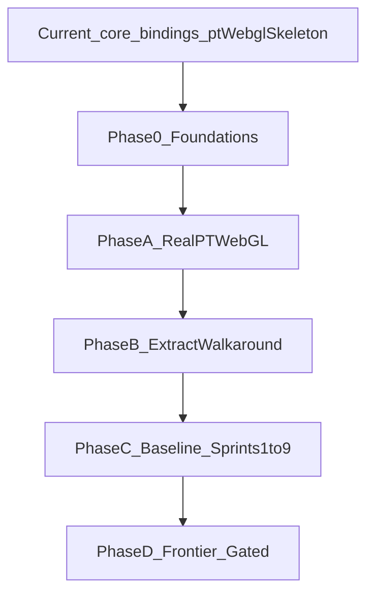
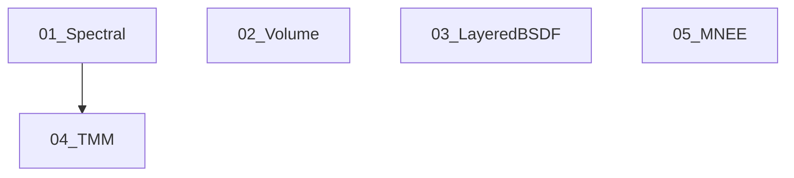

# Cursor-recommended plan — vitrum library buildout (current state → end of Phase D)

**Document type:** Execution-oriented master plan  
**Audience:** Humans and coding agents working in this repo  
**Created:** 2026-05-09  
**Extraction snapshot:** 2026-05-09 — see §2.0 (packages vs `_staging` vs fork).  
**Supersedes nothing:** This complements [library-architecture.md](./library-architecture.md), [sprint-0-api-contract.md](./sprint-0-api-contract.md), and [phase-6-roadmap.md](./phase-6-roadmap.md). Where they disagree on ordering, **this document prefers library-first extraction** and explains why.

**How to use this file**

- Treat each **phase** as a checkpoint: ship the **definition of done** before jumping ahead.
- Treat **mode scope** (walkaround vs PT preview vs PT final) as non-negotiable: one checkbox per mode.
- When a step says **“lands in package X”**, the PR should move or implement code **in `packages/`**, not leave it only in `_staging/` or an external app.
- **External RFEs** in [`external_requests/`](../external_requests/) follow **§13** (triage → core → bindings → backends → benchmarks).

### 0.1 Scope and completeness (read this)

**Line count is not coverage.** This file intentionally mixes: (1) **strategy and phase gates**, (2) **reasoning for major decisions**, and (3) **appendices with inventories and checklists** (below). It does **not** replace:

- **[phase-6-roadmap.md](./phase-6-roadmap.md)** — full per-sprint narrative, risks, effort estimates, decision log §6, verification template §9.  
- **[glorious-hybrid.md](./glorious-hybrid.md)** — deep walkaround architecture verification and phased build detail.  
- **[library-architecture.md](./library-architecture.md)** — package dependency rules.  
- **Per-sprint benchmark files** — `plan/sprint-N-benchmark.md` created at sprint execution time.  
- **Upstream fork history** — every GLSL change on `three-gpu-pathtracer`.

**What “comprehensive” means here:** Every **known work stream** is **named**, **assigned a home package or fork**, and given a **checkpoint**; **staging files** are listed with targets; **contract evolution** and **bindings coverage** are explicit checklists; **gaps** (domain package, host-only UI) are **called out** so they are not mistaken for omissions.

---

## 1. Executive summary

**What vitrum is:** A **browser** rendering engine split into packages: **`@vitrum/core`** (types + lifecycle contract) and **swappable backends** (WebGL2 path tracing, WebGPU hybrid global illumination, future WebGPU path tracing), plus **`@vitrum/shared-*`** building blocks (BVH, samplers, denoisers) and **`@vitrum/three-bindings`** for three.js scenes.

**Where we are today:** The **contract** (`@vitrum/core`) is fully typed. **`@vitrum/three-bindings`** already implements a **working** `sceneFromThreeJS()` (meshes + principal light types + HDRI env from `THREE.Scene`). **`@vitrum/pt-webgl`** implements **`createPTEngine_WebGL2`**, WebGL2 **structural** checks, **capabilities**, and lifecycle — but **`setScene` / `renderFrame` / `update*` still throw** until Sprint 1-style wiring + fork import. **Walkaround and shared packages** (`walkaround-hybrid`, `shared-bvh`, `shared-samplers`, `shared-denoisers`, `pt-webgpu`) remain **empty stubs** (`export {}` or equivalent). **No file has been removed from `_staging/legacy-source/`** yet: all **~61** paths are still canonical reference for GPU work + PT React shell. **`examples/cornell-box`** exists as a **placeholder** (does not import vitrum). Fork **`three-gpu-pathtracer`** is still **not** wired into `pt-webgl` `package.json`.

**Where we are going:**  
- **Phase 0** — Close the loop on Sprint 0 assumptions and repo tooling.  
- **Phase A** — First **honest** renders through **`@vitrum/pt-webgl`** and a **minimal example**; fork wired via `file:`.  
- **Phase B** — Systematic **extraction** of walkaround WGSL/TS into **`@vitrum/walkaround-hybrid`** and shared packages.  
- **Phase C** — **Phase 6 “baseline”** quality and performance on the forked PT path and polished walkaround (maps to Sprints 1–9 + denoising prep in the roadmap). Everything is **verified** per sprint benchmarks.  
- **Phase D** — **Conditional / frontier** work: SVGF upgrade, optional neural final-frame denoise, gated BDPT, PPG, hero-wavelength spectral, custom WebGPU PT, optional custom neural realtime denoiser.

**North-star product goal (unchanged from Phase 6 roadmap):** Hero-quality **stained-glass** imagery (PT final) plus **interactive** PT preview and **walkaround** WebGPU GI — without assuming vitrum’s lifetime equals a React component mount.

*Current node (2026-05-09):* types + `three-bindings` slice + `pt-webgl` factory/skeleton; **`_staging/` untouched**; **Phase B** not started in packages.

---

## 2. Current-state inventory (honest snapshot)

### 2.0 Extraction progress (packages vs staging)

| Stream | Status | Evidence |
|--------|--------|----------|
| **Files deleted from `_staging/` after move** | **0 / ~61** | Nothing migrated out yet; staging is still the live reference tree |
| **`@vitrum/core`** | **Shipped** | `scene`, `frame`, `engine` types + barrel |
| **`@vitrum/three-bindings`** | **Functional slice** | `sceneFromThreeJS()` walks scene graph; meshes → `ScenePrimitive`; Directional / RectArea / Point / Spot → emitters; `scene.environment` → HDRI; unsupported lights throw with clear error |
| **`@vitrum/pt-webgl`** | **Structural only** | `createPTEngine_WebGL2`, caps, `capabilities`, pause/resume/dispose; **rendering methods throw `Not implemented`**; **no** `three-gpu-pathtracer` dependency in package yet |
| **`@vitrum/walkaround-hybrid`** | **Empty stub** | `export {}` only |
| **`@vitrum/shared-bvh`**, **`shared-samplers`**, **`shared-denoisers`**, **`pt-webgpu`** | **Empty stubs** | Same pattern |
| **`examples/cornell-box`** | **Placeholder** | `src/index.ts` is comments + `export {}`; Phase A target |
| **`tools/benchmark-runner`** | **Scaffold** | README + conventions; no `src/` until first benchmark |

**Implication:** **Phase A** is **in progress** — bindings ahead of backend; **Phase B** (walkaround extraction) **not started** in packages.

### 2.1 What exists in `packages/`

| Package | Role today (2026-05-09) | Next step |
|---------|-------------------------|-----------|
| `@vitrum/core` | Full public types | Extend only when a backend **needs** a new field; prefer `extensions` |
| `@vitrum/three-bindings` | **Working** `sceneFromThreeJS` (slice) | Appendix D phases: mesh/Mat variants, instancing, domain profiles |
| `@vitrum/pt-webgl` | **Factory + Engine skeleton**; no GPU path | Add `file:` fork dep; implement `setScene` / `renderFrame` |
| `@vitrum/pt-webgpu` | Empty stub | Phase D |
| `@vitrum/walkaround-hybrid` | Empty stub | Phase B extraction |
| `@vitrum/shared-bvh` | Empty stub | Move `bvhCommon` + tests from staging |
| `@vitrum/shared-samplers` | Empty stub | Port `hammersley.wgsl.ts` etc. |
| `@vitrum/shared-denoisers` | Empty stub | Port à-trous / interfaces |

### 2.2 What exists in `_staging/legacy-source/`

Roughly **61 files** (unchanged count): PT React shell (`PathTracingLayer`, `pathtracerConstants`, postprocessing), walkaround **DDGI**, **Radiance Cascades**, **ReSTIR** (`WalkaroundGPUPipeline`, `ris`/`shade`/… WGSL), `HybridLayeredStage`, BVH compute, etc. **Still the only in-repo home of walkaround + PT shell implementation** until Phase B/A finish migrating.

### 2.3 What exists outside this repo

- **`three-gpu-pathtracer` fork** (`~/projects/three-gpu-pathtracer`, remote `git@github.com:jsquire4/three-gpu-pathtracer.git`) — **all GLSL PT core** for WebGL2.
- **Future host app** — first consumer of `@vitrum/*`; `vitrum-bridge/` hooks live **there** when it exists.

### 2.4 Sprint 0 status (from `plan/sprint-0-api-contract.md`)

Done: core types, workspace, `tsc` clean, CREDITS, README, library-architecture doc, benchmark-runner **README** scaffold.  
**Ahead of original Sprint 0 wording:** `three-bindings` is **more than a stub**; `pt-webgl` is a **structured** `Engine` implementation with **throws** on hot path.  
Deferred / N/A until host exists: `vitrum-bridge/` hooks in host repo.  
**Still blocking Phase 0 exit:** `examples/cornell-box` must **actually import** `@vitrum/core` + `@vitrum/pt-webgl` (even if `renderFrame` still throws until fork lands — or gate on first green pixel per team preference).

---

## 3. Principles and decisions (read once, apply everywhere)

### 3.1 The contract is fixed; backends are replaceable

Public types in `@vitrum/core` are the **compatibility surface**. Backends may differ wildly internally (GLSL vs WGSL, ReSTIR vs brute-force NEE) but must honor **`Engine`** semantics.

**Decision:** Any new feature starts with **“what does `Scene` / `FrameInput` need?”** — not with **“where is the shader?”**

### 3.2 The host owns lifecycle

The engine **does not** own the canvas, GPU device lifetime, or rAF loop. It **does** own resources **it** allocates until `dispose()`.

**Decision:** Examples and docs always show **explicit** `createEngine` → `setScene` → `renderFrame` → `dispose` — never “magic singleton.”

### 3.3 Render modes are intentionally separate implementations

**Walkaround** (WebGPU compute, DDGI + RC + ReSTIR stack) and **PT** (WebGL2, fork) differ in sampling, denoising, and convergence.  

**Decision:** “Both” in any matrix means **two implementations** and **two DoD checkboxes**. No fair counting a walkaround fix as PT progress.

### 3.4 Library-first extraction (Cursor recommendation)

[phase-6-roadmap.md](./phase-6-roadmap.md) lists many **host-shaped file paths** (`PathTracingLayer.tsx`, etc.). That reflected **pre-extraction** work. **Going forward**, each task should name:

1. **`packages/<name>/...`** destination (or `examples/...` for demo UI), and  
2. **Host app** path **only** if the host still owns that UI until parity.

**Decision:** Treat **`examples/cornell-box`** (or a new `examples/minimal-pt`) as the **contract exerciser** so vitrum does not depend on a private monolith to compile.

### 3.5 Feasibility over SOTA cargo-cult

Before scheduling a paper technique: public code, portable to web, not locked to DXR/RTX-only paths. (Phase 6 roadmap §6–7 already encodes this; keep it.)

### 3.6 Denoising: three tiers (single mental model)

| Tier | Technology class | When to use | Depends on |
|------|------------------|-------------|------------|
| **T0** | Temporal + spatial **non-neural** (variance clamp, à-trous, SVGF-class) | **Realtime** walkaround; **preview** PT | Motion / normals / depth where available |
| **T1** | **Neural** final-frame (lazy-loaded): ONNX Runtime **WebGPU** + **WASM** fallback; optional **WebNN** EP | **PT final** “Denoise” button, stills | Albedo + normal + beauty (your Sprint 5 MRT rider) |
| **T2** | **Custom** small UNet in WGSL or highly tuned port | Phase D if T1 cost/latency unacceptable | Training pipeline + legal review of datasets |

**OIDN clarification:** Intel **Open Image Denoise** is **Apache 2.0** open source. It is **not** “proprietary” in the NDA sense. Native OIDN is ideal for **desktop/tooling**; **in-browser**, you typically use **community ports** (e.g. TensorFlow.js + WebGPU, MIT-licensed) **or** your own **exported** model through **ORT-Web** — not “WebNN instead of OIDN” as a false dichotomy: **WebNN** is an **optional accelerator**, not the denoiser itself.

**NRD clarification:** NVIDIA **NRD** is useful as a **reference** for algorithms; its **license** is **not** interchangeable with Apache/MIT for a generic OSS engine dependency. **Do not** make NRD a default dependency of `@vitrum/shared-denoisers`.

### 3.7 Testing and provenance

- Algorithmic / visual changes: **before/after** reference renders in `tools/reference-renders/` (per CLAUDE.md).  
- Citations: implementation comment + package README + [CREDITS.md](../CREDITS.md).

---

## 4. Phase 0 — Close foundations (short, mandatory)

**Goal:** No ambiguity about “what is done” and a place to run the engine without the production host app.

### 4.1 Steps

1. **Example host in-repo**  
   - Add or extend **`examples/*`** so it: creates a `WebGL2` context, imports `@vitrum/pt-webgl`, calls `setScene` + `renderFrame` in a loop (even if initial frames are black / solid color **before** fork integration).  
   - **Reason:** Unblocks Sprint 0’s deferred “host bridge” problem **without** waiting for the stained-glass app.

2. **Benchmark harness placeholder**  
   - Ensure `tools/benchmark-runner` (or documented npm script) exists so Phase C benchmark markdown has a home.

3. **Lock augmentation pattern for texture handles**  
   - Document in `packages/pt-webgl/README.md`: how `unknown` texture handles from `@vitrum/core` map to THREE types (module augmentation).

4. **CREDITS + README cross-links**  
   - Point “recommended build order” to **this file** from README (optional single paragraph; user may do later).

### 4.2 Definition of done (Phase 0)

- [ ] `npm run build` / `tsc` clean from repo root.  
- [ ] At least one **example** (likely `examples/cornell-box`) has **live imports** of `@vitrum/core` + `@vitrum/pt-webgl` + optionally `@vitrum/three-bindings` — today the example is **placeholder-only** (`export {}`).  
- [ ] `plan/cursor-recommended-plan.md` (this file) is the agreed roadmap until revised.

**Note:** `tools/benchmark-runner` README exists; optional checkbox: first `sprint-0-smoke.ts` or defer until Phase C.

---

## 5. Phase A — “Real engine” milestone (first pixels)

**Goal:** `@vitrum/pt-webgl` **actually drives** the forked path tracer for a minimal scene; prove the **contract** works end-to-end.

### 5.1 Wire the fork

**Current state (2026-05-09):** `pt-webgl` **validates** `THREE.WebGLRenderer` + WebGL2 at factory time but does **not** depend on the fork yet; **`setScene` / `renderFrame` throw.**

1. In `packages/pt-webgl`, add dependency **`file:../../../three-gpu-pathtracer`** (adjust relative path per workspace layout; document in pt-webgl README).  
2. Implement **`createPTEngine_WebGL2(options)`** to:  
   - Accept `WebGLRenderingContext` + `THREE.WebGLRenderer` (or document why renderer handle is required).  
   - Instantiate fork **`PathTracingRenderer`** (or equivalent) internally.  
3. Map **`Engine.setScene`** → fork’s scene sync / BVH build entrypoint.  
4. Map **`renderFrame(FrameInput)`** → resolution, camera matrices, sample count / reset flags per `FrameOutput` contract.

**Decisions**

- **Keep fork diff small:** vitrum should **configure** the fork, not fork-the-fork unless necessary.  
- **Feature parity is not required** in Phase A — **“runs Cornell box / minimal glass”** is enough.

### 5.2 three-bindings (minimal vertical slice)

**Status:** **`sceneFromThreeJS` already covers** indexed triangle meshes (with `MeshPhysicalMaterial`-style path), **Directional / RectArea / Point / Spot** lights, and **HDRI** via `threeScene.environment`.  

**Remaining for Phase A / Appendix D:** instancing, skinned/morph meshes (throw or support), mesh-area emitters, richer material fields, and stained-glass **domain** profiles — without blocking first pixels.

**Reason:** Unblocks examples without pretending full stained-glass scene coverage.

### 5.3 shared-bvh / shared-samplers (scaffold only)

- **`shared-bvh`:** thin wrapper extracting **pure data** helpers first (attribute packing **documentation** + types) before moving heavy compute from staging.  
- **`shared-samplers`:** Hammersley / Sobol **used by both** stacks — port from `_staging` WGSL/TS with tests.

### 5.4 Definition of done (Phase A)

- [ ] Example: **interactive** PT camera + accumulating image from `@vitrum/pt-webgl`.  
- [ ] Document: “Known limitations” list (materials not supported yet).  
- [ ] One **reference render** committed for regression baseline.

---

## 6. Phase B — Extraction waves (walkaround + shared infra)

**Goal:** Move **`_staging/legacy-source`** into real packages without a “big bang.” Use **vertical slices**: each slice compiles, runs, and has a benchmark or visual check.

### 6.1 Wave B1 — `shared-bvh`

**Source:** `_staging/.../walkaround/lib/bvhCommon.ts`, related tests, stride-3 vs stride-4 documentation.

**Deliverables**

- Package API for “build uploads for three-mesh-bvh layout consumed by WGSL” vs “WebGL2 path.”  
- Unit tests promoted with the code.

**Reason:** Both walkaround and PT depend on **consistent** BVH + attribute semantics (emitter extraction, glass flags).

### 6.2 Wave B2 — `walkaround-hybrid` core pipeline

**Order of extraction (dependency-safe)**

1. **Math + types:** `walkaroundBridgeTypes`, UBO layouts, atlas layout constants.  
2. **BVH GPU buffers:** from shared-bvh + staging `bvhCompute.ts` patterns.  
3. **ReSTIR passes:** `common` → `ris` → `temporal` → `spatial` → `shade` (match current compile order).  
4. **DDGI + RC** integrations that `shade` expects (bind groups, sentinel “wired” checks).  
5. **Denoise:** `atrous` + temporal accumulation passes.  
6. **Orchestrator:** slim `WalkaroundGPUPipeline` into **`@vitrum/walkaround-hybrid`** public class implementing `Engine`.

**Decisions**

- Preserve **primary-ray-cast mode** behavior unless you have a project-wide reason to reintroduce raster G-buffer (staging comments explain past bugs with placeholders).  
- Keep **React** out of `@vitrum/walkaround-hybrid` public API — host provides canvas/device; optional **`examples/*`** can wrap React.

### 6.3 Wave B3 — PT integration ergonomics

- Move **host-agnostic** pieces of `pathtracerConstants` concept into **`EngineOptions.extensions`** or `FrameInput` rather than hard-coding app constants in the package. **Reason:** libraries should not own product-specific timing-budget constants; host apps pass budgets explicitly.

### 6.4 Definition of done (Phase B)

- [ ] `@vitrum/walkaround-hybrid` runs the **same** chroma/visual tests you used pre-extraction (**hardware-GPU** where applicable — see [hardware-gpu-validation-spec.md](./hardware-gpu-validation-spec.md)).  
- [ ] `_staging/` either shrinks or is clearly marked **deprecated** per module moved.  
- [ ] Diagram in `walkaround-hybrid/README.md`: pass DAG + buffer list.

---

## 7. Phase C — Phase 6 baseline: quality, convergence, preview perf (Sprints 1–9)

This phase aligns with [phase-6-roadmap.md](./phase-6-roadmap.md) **Sprints 1–9**, reinterpreted so **deliverables land in packages + fork** and **examples** replace mystery host paths.

Below: **sprint intent**, **mode**, **primary code destination**, **verification**.

### 7.1 Sprint 1 — PT preview speed wins

- **Intent:** Fast, pleasant preview: working HDRI URLs, lower preview bounces, lower effective resolution, skip heavy post for first N samples, sensible orbit damping where applicable.  
- **Modes:** PT preview (+ shared controls if you keep them in example).  
- **Destinations:** `packages/pt-webgl` options; `examples/*`; fork only if constants must live there.  
- **Verify:** fps / frame time; network 200 on presets; documented in `plan/sprint-1-benchmark.md`.

### 7.2 Sprint 2 — Per-cell / emitter power precompute (“foundation for light tree”)

- **Intent:** Emitter power + area semantics consistent between modes for **shared** light importance infrastructure.  
- **Modes:** **Both** (two implementations).  
- **Destinations:** `@vitrum/shared-bvh` or dedicated **emitters** helper module; walkaround `bvhCompute` consumer; **fork** material/light uploads for PT.  
- **Verify:** doubling `Le` doubles stored power in both modes (roadmap DoD).

### 7.3 Sprint 3 — Mixture PDF + light tree + back-face NEE fixes (PT)

- **Intent:** Large variance reduction in interior PT shots.  
- **Modes:** PT preview + final only; walkaround stays on ReSTIR.  
- **Destinations:** **fork** shaders + small TS helper if light tree build is CPU-side in package.  
- **Verify:** stddev at fixed spp vs baseline (roadmap).

### 7.4 Sprint 4 — BSDF cost reduction (PT)

- **Intent:** `lobeMask`, lite indirect BSDF, material LOD textures by depth.  
- **Modes:** PT only.  
- **Destinations:** fork shaders; profile ms/sample.

### 7.5 Sprint 5 — Analytic came + MRT G-buffer scaffold (PT)

- **Intent:** Fewer BVH traversals for came; **MRT** for normal/depth/albedo feeding later denoise.  
- **Modes:** PT only.  
- **Destinations:** fork + `pt-webgl` binding code for MRT targets.  
- **Decision:** Keep **mesh fallback** always (roadmap).  
- **Verify:** node visit reduction; device-tier disable path tested.

### 7.6 Sprint 6 — Rough refraction + preview spatial cleanup (PT)

- **Intent:** Better glass realism + cheap spatial cleanup at low spp preview.  
- **Modes:** PT; spatial filter **preview only** if roadmap retained.  
- **Destinations:** fork + optional `@vitrum/shared-denoisers` **preview** filter module.

### 7.7 Sprint 7 — Volumetrics + SSS (PT)

- **Intent:** God rays + translucent materials.  
- **Modes:** PT only; **depends** on Sprint 3 (+ Sprint 6 helper reuse).  
- **Destinations:** fork + possible `@vitrum/core` `SceneVolume` shape decision.  
- **Decision gate:** Global homogeneous volume first; per-region deferred.

### 7.8 Sprint 8 — RGB-as-3λ dispersion + Jakob–Hanika rider (PT)

- **Intent:** Bevel rainbows without full hero-wavelength PT.  
- **Modes:** PT only.  
- **Destinations:** fork + material extension fields documented in core.

### 7.9 Sprint 9 — Walkaround adaptive sampling + checkerboard (walkaround only)

- **Intent:** Better convergence efficiency in **realtime** walkaround.  
- **Modes:** Walkaround only (roadmap rejects coarse PT adaptive in that sprint budget).  
- **Destinations:** `@vitrum/walkaround-hybrid` WGSL + orchestration; **Welford** struct versioned in `common.wgsl` per roadmap Decision 13.

### 7.10 Phase C exit criteria

- [ ] All Sprint 1–9 DoD items exist as **checked** benchmark docs OR explicitly deferred with **written** rationale.  
- [ ] No critical technique exists only in `_staging` — staging is reference or deleted.  
- [ ] **Mode parity:** documented matrix matches reality (PT vs walkaround).

---

## 8. Phase D — Frontier and conditional work (Sprints 10+)

**Goal:** Optional **quality ceiling** and **research-grade** features **gated** by triggers — never blocking baseline shipping.

### 8.1 Sprint 10a — SVGF-class spatiotemporal denoising

- **Modes:** Walkaround replaces / upgrades à-trous; PT preview upgrades spatial stage.  
- **Destinations:** `@vitrum/shared-denoisers` with **separate** implementations if needed.  
- **Feasibility:** No universal WebGPU SVGF npm package — expect **real implementation time** (roadmap 1.5–2 weeks is plausible).  
- **Verify:** A/B at fixed spp against reference.

### 8.2 Sprint 10b — Neural final-frame denoise (PT final)

- **Modes:** PT final / export only (not realtime default).  
- **Stack decision (recommended):**  
  1. **Primary:** ONNX Runtime Web + **WebGPU** EP + **WASM** fallback.  
  2. **Optional:** `webnn` EP when browser signals support.  
  3. **Parallel spike:** MIT-licensed **TF.js** ports for OIDN-class UNets if ONNX export path is painful.  
- **Inputs:** beauty + albedo + normal from **Sprint 5 MRT**.  
- **Legal:** Apache 2.0 (OIDN ecosystem), MIT wrappers — still require **NOTICE** hygiene.

### 8.3 Sprint 10c — BDPT for caustics (conditional)

- **Trigger:** Only if Sprint 7 leaves visible caustic gap at agreed sample budget.  
- **Modes:** PT final.  
- **Risk:** WebGL2 **without compute** makes storage awkward — roadmap already warns **≥2 weeks** realistic.

### 8.4 Sprint 11 — PPG path guiding (walkaround)

- **Trigger:** After 10a; composes with adaptive + SVGF.  
- **Destinations:** `walkaround-hybrid` only.

### 8.5 Sprint 12 — Hero-wavelength spectral (conditional)

- **Trigger:** Material set demands it (uranium/dichroic/etc.).  
- **Destinations:** fork major rewrite; **pt-webgpu** may ultimately be the cleaner home.

### 8.6 Sprint 13 — Custom WebGPU neural denoise (walkaround)

- **Trigger:** SVGF gap + WebNN still immature + PPG insufficient (per roadmap Decision 14).  
- **Destinations:** training pipeline offline; inference WGSL or small runtime.

### 8.7 `pt-webgpu` — WebGPU-native path tracer (Phase D capstone)

**When:** After **Phase C** proves the **contract** and **material** story; not before you’ll otherwise drown in two PT backends without users.

**Why:** Escape WebGL2 limits (compute, dispersion, guiding) with **one** clean WGSL codebase — but **large**.

**Minimum viable `pt-webgpu`:**

- Feature subset: Lambert + GGX + glass + env; software BVH; MIS NEE; accumulation buffer.  
- Grow toward hero-wavelength + neural extras **only** with explicit milestones.

### 8.8 Definition of done (Phase D)

Each gated sprint ships **only** if its **trigger** is satisfied; document **“deferred / not needed”** explicitly.

---

## 9. Host-application integration playbook (when the real app exists)

This section is **future** work in the stained-glass (or other) app — not in vitrum proper.

1. **`vitrum-bridge/`** directory with:  
   - `useVitrumPTEngine` — lifecycle mirrors old hook but owns **vitrum** `Engine`.  
   - `useVitrumWalkaroundEngine` — same.  
2. **Dual-run period:** feature flags compare old vs new renderer for A/B.  
3. **Cutover:** when vitrum passes visual + perf gates, delete embedded legacy engine imports.

**Reason:** Migration risk is isolated from **package** correctness.

---

## 10. Risk register (honest)

| Risk | Mitigation |
|------|------------|
| Extraction breaks subtle WGSL packing | Lock three-mesh-bvh layout tests; hardware GPU validation spec |
| PT ↔ walkaround parity assumed | Mode matrix + separate DoD |
| WebNN still immature | ORT-WebGPU primary; WebNN optional |
| OIDN “license fear” stalls neural work | Use this doc’s OIDN Apache 2.0 clarification; lawyer for distribution only if needed |
| Scope creep in `pt-webgpu` | MVP subset + kill criteria |
| Host app blocks testing | **examples/** as first-class host (Phase 0–A) |

---

## 11. Mapping cheat sheet

### 11.1 Staging → package (high level)

| Staging area | Primary package |
|--------------|-----------------|
| `walkaround/engines/restir/**` | `@vitrum/walkaround-hybrid` |
| `walkaround/ddgi*, probe*, useDDGI` | `@vitrum/walkaround-hybrid` + shared |
| `walkaround/cascade*` | `@vitrum/walkaround-hybrid` |
| `walkaround/lib/bvhCommon*` | `@vitrum/shared-bvh` |
| `PathTracingLayer`, `pathtracerConstants` | **examples/** + small glue in `@vitrum/pt-webgl` |
| Actual GLSL PT | **fork** `three-gpu-pathtracer` |

### 11.2 Where to put new denoisers

| Tier | Package |
|------|---------|
| T0 non-neural | `@vitrum/shared-denoisers` |
| T1 neural final | `@vitrum/shared-denoisers` + lazy dynamic import OR subpath export |
| T2 custom WGSL | `@vitrum/shared-denoisers` or `walkaround-hybrid` if tightly coupled |

---

## 12. Final checklist: “are we done with Phase D?”

You are **done** when:

- [ ] `examples/` demonstrate **PT** (`pt-webgl`) and **walkaround** (`walkaround-hybrid`) **without** private repos.  
- [ ] `pt-webgpu` either **ships MVP** or has a **written deferral** with technical reason.  
- [ ] Denoise story: **T0 everywhere**, **T1** for final-frame PT, **T2/T3** only if triggers hit.  
- [ ] CREDITS + per-implementation citations complete.  
- [ ] README points maintainers to **this plan** + phase-6 roadmap.

---

## 13. External feature requests (`external_requests/`)

Formal RFEs live as numbered markdown specs in [`external_requests/`](../external_requests/). **Default policy (two tiers):**

- **Tier 1 — contract early:** As soon as an RFE is **Accepted**, land **types** (prefer `Material.extensions` / `EngineOptions.extensions`) and **`@vitrum/three-bindings` stubs** — target **Phase 0 exit checklist** or the **first weeks of Phase A**, not “when Phase B starts.”  
- **Tier 2 — implementation:** Backend work, fork changes, and benchmarks stay mapped to **§13.2** (Phase B overlap + Phase C sprints).

RFEs are **not** pushed to **Phase D** unless they are explicitly `pt-webgpu`-only or contingent on frontier triggers. Phase D remains for **true** optional/experimental work — not the primary home for RFEs 01–05.

Each RFE is still **triaged** (accept / defer / reject), then folded into **`@vitrum/core`**, **bindings**, and **backend** work with benchmarks.

### 13.1 Process to “include” an RFE (repeat per request)

1. **Triage** — Set status in [`external_requests/README.md`](../external_requests/README.md) (`Proposed` → `Accepted` → `Implemented` or `Deferred` + reason).  
2. **`@vitrum/core`** — As soon as the RFE is **Accepted**, add or extend types exactly as the RFE specifies (prefer **`Material.extensions` / `EngineOptions.extensions`** until the shape stabilizes; promote to top-level fields when two backends implement it). Target **Phase 0 closeout or early Phase A** for this step — **do not** defer serializable contract work until Phase B extraction ramps. Update [CREDITS.md](../CREDITS.md) + implementation-site comments.  
3. **`@vitrum/three-bindings`** — Map new fields from `THREE` materials/lights where applicable; document unsupported paths per [Appendix D](#appendix-d--three-bindings-phased-coverage).  
4. **Backends** — Implement in **mode-scoped** order: usually **`pt-webgl` (fork)** first for path-traced truth, then **`pt-webgpu`** if relevant, then **walkaround** only if the RFE allows realtime approximations (many do not).  
5. **Verification** — Reference scene + `plan/sprint-N-benchmark.md` or `plan/rfe-<id>-benchmark.md`; before/after frames in `tools/reference-renders/`.  
6. **Roadmap hygiene** — Add a row to [phase-6-roadmap.md](./phase-6-roadmap.md) mode matrix when the feature ships (or document explicit **waiver**).

- **Contract timing:** Accepted RFEs must not block on Phase B for **serializable** `@vitrum/core` + `three-bindings` work — that is **Tier 1** (§13 opening).

### 13.2 RFE → plan mapping (what needs doing) — **accelerated timeline**

| File | Topic | Primary contract touch | `pt-webgl` / fork | `pt-webgpu` | Walkaround | **Target (early)** | Notes |
|------|--------|------------------------|-------------------|-------------|------------|----------------------|-------|
| [01-spectral-rendering.md](../external_requests/01-spectral-rendering.md) | Spectral μ(λ), Abbe dispersion, hero-λ | `Material` (+ curve / Abbe types in **extensions** first) | **Sprint 8** fork work **on schedule**; optional **Sprint 6–7 spike** for dispersion constants / data paths so Sprint 8 is merge-only | Defer detailed parity to `pt-webgpu` later | Approximate; document caps | **Phase 0–A:** lock types + `three-bindings` stubs; **Phase C S6–S8:** implementation | **Tier 1** early; **Phase B+:** no contract surprise. Pull **Sprint 12 hero-λ evaluation** forward only if Sprint 8 completes **ahead** of plan — otherwise keep hero-λ as explicit opt-in |
| [02-volume-scattering.md](../external_requests/02-volume-scattering.md) | HG phase, σ_s, media | `Material` + `SceneVolume` / globals | **Start Sprint 6** (overlap end of Sprint 5): volume path stub + integration with MRT/analytic work; **Sprint 7** completes equi-angular + quality bar | Natural in compute PT | Approximations only | **Phase C S5–S7** (not “late” 7) | **Phase A tail or Sprint 1:** add `SceneVolume` (or extension) to `core` — **no later than** Phase C Sprint 4 — so volume work in S5–S7 is not a late contract add |
| [03-layered-bsdf.md](../external_requests/03-layered-bsdf.md) | Front/back asymmetric stack | `Material` asymmetry / coating types | **Sprint 4–6** with BSDF + material LOD (S4) and glass/came work (S5–S6) | `pt-webgpu` when relevant | Symmetric until needed | **Phase C S4–S6** | **Not** Phase D — coatings matter for stained-glass realism early |
| [04-multilayer-thinfilm.md](../external_requests/04-multilayer-thinfilm.md) | TMM stack | `Material.thinFilmStack` (or extension) | **Sprint 8–9** immediately after RGB-3λ / spectral band lands (same baseline window) | Follows `pt-webgpu` spectral | Usually off | **Phase C S8–S9** | Was “Phase D”; **moved up** to ride the same shader churn as Sprint 8 |
| [05-manifold-nee.md](../external_requests/05-manifold-nee.md) | MNEE / photon map option | `EngineOptions` + `EngineCapabilities` | **Sprint 8:** caustic spike + fork prototype; **Sprint 9:** target **shippable** MNEE or documented cutline | Compute-friendly later | Not full MNEE | **Phase C S8–S9** | **Decision memo by end Sprint 8:** MNEE vs **§8.3 10c BDPT** — avoid parking both in Phase D |

### 13.3 Decision gates (avoid duplicate caustic efforts)

- **By end of Sprint 8:** Run the **caustic strategy spike** (see `plan/sprint-10c-vs-mnee.md`): compare **05 MNEE** prototype vs **§8.3 Sprint 10c BDPT** cost/quality on the fork at a fixed SPP budget. **Sprint 9** implements the chosen primary path; **10c** remains **conditional backup** only if MNEE fails acceptance tests.  
- **Before 04 (TMM) lands in the fork:** Ensure **01 / Sprint 8** spectral band or RGB-as-3λ path is in flight — TMM evaluation needs wavelength samples or agreed RGB compromise (document the compromise in the benchmark).

### 13.4 Dependencies between RFEs

**05 (MNEE)** is API-independent of 01–04; it competes for schedule with **Sprint 10c (BDPT)**. **03** benefits from **01** once glass colors are wavelength-accurate but does not strictly block on it.

### 13.5 Why “early” (scheduling principle)

- **Contract first (Phase 0–A):** Accepted RFEs add **types and bindings** before extraction and Phase C shader waves peak, so downstream packages do not fork `Scene` twice.  
- **Shader churn once:** TMM, dispersion, and volume touch the **same** GLSL path as Sprint 4–8; doing them in **Phase C S4–S9** avoids a second full shader retrofit in Phase D.  
- **Caustics are product-critical:** MNEE/BDPT decision moves to **S8–S9** so hero renders are not blocked on a far-future Phase D milestone.

---

## 14. Appendices — exhaustive inventories and checklists

The sections below are the **detailed bill of materials** that the main phases summarize. Agents should treat unchecked items as pending work unless explicitly deferred with rationale.

### Appendix A — `_staging/legacy-source` file → destination map

**Migration log:** As of **2026-05-09**, **zero** rows below are “done”: every file listed still exists under `_staging/` with **no** corresponding delete/move into `packages/`. Package work to date is **parallel** (new `three-bindings` / `pt-webgl` code), not file-by-file migration.

Source tree per [_staging/README.md](../_staging/README.md). **Host-only** means stay in `examples/*` or future host app, not in engine packages.

| Path (under `legacy-source/src/rendering/scene/`) | Destination | Notes |
|---------------------------------------------------|-------------|-------|
| `walkaround/HybridLayeredStage.tsx` | `examples/` or host | React; engine exposes API only |
| `walkaround/WalkaroundStage.tsx` | `examples/` or host | Legacy stage; deprecate when hybrid example wins |
| `walkaround/applyDDGIShading.ts` | Split: DDGI **sample** WGSL → `walkaround-hybrid`; material **injection** pattern → docs + optional host helper |
| `walkaround/bvhCompute.ts` (outer) | `shared-bvh` + thin adapter in `walkaround-hybrid` | RC-oriented packing vs ReSTIR |
| `walkaround/cascadeDispatch.ts` | `walkaround-hybrid` | |
| `walkaround/cascadePyramid.ts` | `walkaround-hybrid` | |
| `walkaround/ddgiAtlasLayout.ts` | `walkaround-hybrid` (or `shared-bvh` if reused) | Constants shared with `ddgiSampleWgsl` |
| `walkaround/ddgiSampleWgsl.ts` | `walkaround-hybrid` | |
| `walkaround/engineRegistry.ts` | `examples/` or small `walkaround-hybrid` export | Engine selection is host UX |
| `walkaround/engines/rc/*` | `walkaround-hybrid` | |
| `walkaround/engines/restir/RestirStage.tsx` | `examples/` | |
| `walkaround/engines/restir/WalkaroundDebugBridge.tsx` | `examples/` (dev only) | |
| `walkaround/engines/restir/WalkaroundGPUPipeline.ts` | `walkaround-hybrid` (+ **split**, Appendix H) | |
| `walkaround/engines/restir/bvhCompute.ts` | `walkaround-hybrid` | ReSTIR-specific packing |
| `walkaround/engines/restir/shaders/*.wgsl.ts` | `walkaround-hybrid` | |
| `walkaround/engines/restir/walkaroundBridgeTypes.ts` | `walkaround-hybrid` | |
| `walkaround/giReceiver.ts` | `walkaround-hybrid` or host | Depends on raster coupling |
| `walkaround/gpuDetection.ts` | `walkaround-hybrid` or `core` util | If moved to core, keep types minimal |
| `walkaround/lib/bvhCommon.ts` | `shared-bvh` | |
| `walkaround/lib/bvhCommon.test.ts` | `shared-bvh` | |
| `walkaround/lib/nodeMaterialUpgrade.ts` | `three-bindings` or `walkaround-hybrid` docs | Tier-2 material upgrade |
| `walkaround/lib/useSceneBVH.ts` | `walkaround-hybrid` | Deduplicate with outer `useSceneBVH.ts` |
| `walkaround/lib/wgpuSupport.ts` | `shared-bvh` or `walkaround-hybrid` | |
| `walkaround/probeGrid.ts` | `walkaround-hybrid` | |
| `walkaround/probeUpdatePass.ts` | `walkaround-hybrid` | |
| `walkaround/sceneBvh.ts` | `shared-bvh` | |
| `walkaround/useCascadeBuffers.ts` | `walkaround-hybrid` | |
| `walkaround/useDDGI.ts` | `walkaround-hybrid` | |
| `walkaround/useHybridLayeredGI.ts` | `examples/` (React) + orchestration class in package | |
| `walkaround/useSceneBVH.ts` (outer) | Merge with lib copy in one package location | |
| `walkaround/walkaroundDiffuseLighting.ts` | `walkaround-hybrid` or host | |
| `walkaround/wgsl/hammersley.wgsl.ts` | `shared-samplers` | |
| `walkaround/wgsl/octahedral.wgsl.ts` | `shared-bvh` | |
| `walkaround/wgsl/probeUpdateBlend.wgsl.ts` | `walkaround-hybrid` | |
| `walkaround/wgsl/probeUpdateRays.wgsl.ts` | `walkaround-hybrid` | |
| `PathTracingLayer.tsx` | `examples/` + `pt-webgl` docs | Thin wrapper pattern |
| `PathtracerSceneSync.tsx` | `pt-webgl` (logic) / `examples` (React) | Scene sync → `setScene` |
| `PathtracerDebugBridge.tsx` | `examples/` dev only | |
| `PTStage.tsx` | `examples/` | |
| `PTPostProcessing.tsx` | `examples/` + optional `shared-denoisers` hooks | Post is host-assembled Effect chain |
| `PTDeviceLostBoundary.tsx` | `examples/` | |
| `cameraLookPresets.ts` | `examples/` or `three-bindings` optional util | |
| `pathtracerConstants.ts` | `pt-webgl` defaults + host overrides | |
| `ptDebounce.ts` | `examples/` | |
| `ptEnvironment.ts` | `pt-webgl` + `three-bindings` | IBL wiring |
| `ptIblBaker.ts` | `pt-webgl` or `shared-*` | Procedural sky bake |
| `lightingState.ts` | `examples/` or small `core` extension | Single source of truth for sun/sky may stay host |
| `skyParams.ts` | `pt-webgl` / bindings | |
| `outdoorHdri.ts` | `pt-webgl` | |
| `outdoorScenePresets.ts` | `examples/` + data | Sprint 1 URLs |
| `lightingIntensityTable.ts` | Host or `pt-webgl` config | |
| `lighting/usePTPipelineConfig.ts` | `examples/` | |
| `lighting/usePTSampleTarget.ts` | `examples/` | |
| `lighting/renderers/sunPathTraced.tsx` | Host / examples | Shaped sun — domain |

**Not in staging (explicit):** entire **three-gpu-pathtracer** fork — tracked as sibling repo; all **GLSL** changes land there until `pt-webgpu` exists.

**Deliberately excluded from vitrum core (per _staging README):** stained-glass **domain** types (panel/cell/came product model). Plan a **`@vitrum/domain-stained-glass`** or host-only layer **later**; do not block engine extraction on it.

---

### Appendix B — Phase 6 sprint master table (roadmap alignment)

Full narrative, risks, and decision log: [phase-6-roadmap.md](./phase-6-roadmap.md). This table is the **control panel**.

| Sprint | Theme | Walkaround | PT prev | PT final | Primary code locus | Depends |
|--------|-------|------------|---------|----------|-------------------|---------|
| 0 | API contract | — | — | — | `packages/core`, stubs | — |
| 1 | PT preview perf + HDRI | Orbit shared | ✓ | ✓ | `examples`, `pt-webgl`, fork constants | — |
| 2 | Emitter power / area | ✓ | ✓ | ✓ | `shared-bvh`, walkaround `bvhCompute`, fork | — |
| 3 | Mixture PDF + light tree | — | ✓ | ✓ | Fork | 2 |
| 4 | BSDF cost cut | — | ✓ | ✓ | Fork | — |
| 5 | Analytic came + MRT | — | ✓ | ✓ | Fork, `pt-webgl` | — |
| 6 | Rough refraction + spatial | — | ✓ | preview spatial | Fork, `shared-denoisers` | 4 ideal |
| 7 | Volume + SSS | — | ✓ | ✓ | Fork, `core` volume? | 3, 6 |
| 8 | RGB‑3λ + Jakob–Hanika | — | ✓ | ✓ | Fork | — |
| 9 | Adaptive + checkerboard | ✓ | — | — | `walkaround-hybrid` | — |
| 10a | SVGF | ✓ | ✓ preview | — | `shared-denoisers` | 9 |
| 10b | Neural final denoise | — | — | ✓ | `shared-denoisers` + lazy ML | 5 MRT |
| 10c | BDPT | — | — | ✓ (gated) | Fork | 7 re-eval |
| 11 | PPG guiding | ✓ | — | — | `walkaround-hybrid` | 9+10a |
| 12 | Hero spectral | — | ✓ | ✓ (gated) | Fork / `pt-webgpu` | material trigger |
| 13 | Custom neural RT | ✓ | — | — | `walkaround-hybrid` / training | 10a gap |

**Effort rollup (from roadmap §8, indicative):** baseline S1–9 ~37.5 engineer-days in original estimates; frontier S10–13 months if all triggers fire.

---

### Appendix C — `@vitrum/core` contract evolution checklist

From [sprint-0-api-contract.md](./sprint-0-api-contract.md) open decisions; **lock** when listed sprint kicks off.

| Topic | Current state | Lock when | Notes |
|-------|---------------|-----------|-------|
| `updatePrimitive` / diff API | On `Engine`, unimplemented | Sprint 3 light-tree rebuild | Define patch shape + dirty flags |
| `Material.extensions.spectral` | Reserved | Sprint 8 (RGB‑3λ) / Sprint 12 | |
| `FrameInput.shutterTime` / motion | In type, unused | Sprint 10+ scene fidelity | Per-primitive motion vectors |
| `SceneVolume` / global medium | Absent or partial | Sprint 7 kickoff | Global-only vs regions |
| Texture handle type | `unknown` | Sprint 1 real `pt-webgl` | Module augmentation per backend |
| `EngineOptions.extensions` | Use for host constants | Phase A/B | Replace magic `pathtracerConstants` coupling |

---

### Appendix D — `three-bindings` phased coverage

Order minimizes **time-to-first-pixel** while climbing toward stained-glass fidelity.

| Phase | Meshes | Lights | Materials | Textures / env |
|-------|--------|--------|-----------|----------------|
| D0 (Phase A) | Indexed `BufferGeometry`, one PBR family | Directional + HDRI | Basic `MeshPhysicalMaterial` subset | Single env map path |
| D1 | Skinned / morph **defer** or throw clear `UnsupportedError` | Area rects (emitters) | Transmission flag | IBL + optional HDR URL |
| D2 | Instancing | Spot, point | Full glass params thickness/att dist | Texture transforms |
| D3+ | User meshes | Full light tree data for PT | Domain-specific profiles | Optional `extensions` for host-authored cells |

Each phase: **unit test** round-trip count (object counts); **example** scene that proves it.

---

### Appendix E — Examples and tooling matrix

| Artifact | Purpose | Phase |
|----------|---------|-------|
| `examples/minimal-pt` (or extend `examples/cornell-box`) | WebGL2 + `pt-webgl` + orbit | 0–A |
| `examples/walkaround-basic` | WebGPU device + `walkaround-hybrid` + resize | B |
| `examples/hybrid-full` (optional) | DDGI+RC+ReSTIR parity with staging | B–C |
| `tools/benchmark-runner` | Sprint N benchmark automation hooks | 0 |
| `tools/reference-renders/*` | Before/after regression | Every algorithm sprint |
| `plan/sprint-N-benchmark.md` | Signed DoD per sprint | C–D |

---

### Appendix F — Fork and vendor strategy (decision record)

_Choose one primary pattern and document in `packages/pt-webgl/README.md`._

| Option | Pros | Cons |
|--------|------|------|
| Sibling `file:../three-gpu-pathtracer` | Simple, preserves fork git | CI must clone/check out sibling |
| Git submodule under `vendor/` | Reproducible SHA | Submodule friction |
| **npm `file:` workspace package** | Monorepo-friendly if fork copied in | Large tree; two copies of history |

**Rule:** Fork **mainline** stays the integration point for **all GLSL PT** until `pt-webgpu` supplants features.

---

### Appendix G — CI, tests, and quality gates

Minimum recommended **before** calling Phase B “done”:

- **`tsc --noEmit`** workspace root on every PR.  
- **Unit tests** wherever `_staging` had `*.test.ts` — must move with module.  
- **Optional: headless e2e** — blocked by real WebGPU on runners (see [hardware-gpu-validation-spec.md](./hardware-gpu-validation-spec.md)); document **manual** GPU gate for walkaround.  
- **`CREDITS.md`** updated when adding algorithms.  
- **Package README** diagrams for `walkaround-hybrid` and `pt-webgl` after Phase B/A respectively.

---

### Appendix H — `WalkaroundGPUPipeline.ts` decomposition checklist

The staged file is ~1287 LOC; extraction **must** split along pass boundaries (see [path-tracer-library-readiness.md](./path-tracer-library-readiness.md)).

Suggested modules inside `walkaround-hybrid`:

1. `DeviceInit` / adapter limits / feature detection  
2. `BindGroupFactory` per pass family  
3. `ReSTIRPassBundle` (RIS, temporal, spatial)  
4. `ShadePass` (DDGI/RC bind + composite)  
5. `DenoisePass` (à-trous, temporal accum)  
6. `FrameOrchestrator` (queue submit order, buffer ping-pong)  
7. `DebugTelemetry` (optional; replaces `window.__WGPU__` coupling in library mode)

Each module: **single responsibility**, **testable** UBO layout constants, **no React**.

---

### Appendix I — `pt-webgpu` phased capability matrix (Phase D capstone)

| Stage | Capabilities | Non-goals |
|-------|--------------|-----------|
| **I0 MVP** | Primary visibility, MIS env + one NEE strategy, Lambert + GGX + single glass model, accumulation, three-bindings | Spectral, volumes, full Disney |
| **I1** | Light tree / mixture sampling parity with fork | Feature race with fork — pick one source of truth per feature |
| **I2** | Dispersion (RGB‑3λ), MRT guides | Hero-wavelength |
| **I3** | Volumes, SSS | |
| **I4** | Optional neural / SVGF on WebGPU | |

**Kill criterion:** If I0 slips > N months without user need, defer and deepen `pt-webgl` instead.

---

### Appendix J — Documentation deliverables by package

| Package | README must include |
|---------|---------------------|
| `core` | Lifecycle diagram; link to `Engine` |
| `three-bindings` | Coverage table (Appendix D) + unsupported throw policy |
| `pt-webgl` | Fork pin, MRT later, known limits |
| `pt-webgpu` | Feature stage (Appendix I), hardware reqs |
| `walkaround-hybrid` | Pass DAG, buffer list, primary-ray-cast mode |
| `shared-bvh` | Layout diagrams, endian/packing warnings |
| `shared-samplers` | Citation for QMC sequences |
| `shared-denoisers` | T0/T1/T2 tiers; lazy-load neural |

---

### Appendix K — Explicit non-goals (avoid scope creep)

- **npm publish** — until you explicitly greenlight (per CLAUDE.md).  
- **Upstream PRs** to gkjohnson pathtracer — without instruction.  
- **NRD SDK** as required dependency — license incompatible with “drop-in OSS engine” goal.  
- **Hardware WebGPU ray tracing extension** — do not plan critical path on it (gpuweb issue remains long-term).  
- **Single implementation for PT + walkaround** when matrix says “both.”

---

### Appendix L — Post–Phase D operations (maintenance)

- **Versioning:** semver per package; breaking `core` = major across consumers.  
- **Migration notes:** when `Scene` grows, publish **migration** snippet in changelog.  
- training pipeline for custom denoiser (if Sprint 13): **own repo** or `tools/` with pinned Python — keep vitrum npm install lean.

---

### Appendix M — “Done” criteria recapped by phase (rollup)

| Phase | Mechanical completion |
|-------|------------------------|
| 0 | Example **live imports** vitrum packages (cornell-box today: **not yet**); benchmark README may exist |
| A | PT pixels from `pt-webgl` + 1 reference render |
| B | Walkaround package runs; staging shrunk/deduped; tests moved |
| C | Sprints 1–9 benchmarks signed or waived in writing |
| D | Triggers for 10c–13 evaluated; `pt-webgpu` MVP or deferral doc |

---

## 15. Document control

- **Owner:** Project maintainer (`jsquire4`)  
- **Revision policy:** Update at phase boundaries; do not silently contradict `library-architecture.md` — reconcile in PR if needed.  
- **Related reading:** [glorious-hybrid.md](./glorious-hybrid.md) (walkaround strategic depth), [path-tracer-library-readiness.md](./path-tracer-library-readiness.md) (extraction hygiene findings).

---

*End of cursor-recommended-plan.md*
