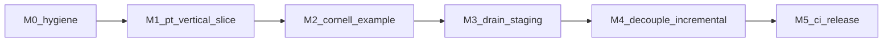

# Plan: toward a generalized vitrum library

This document is the **forward plan** for turning vitrum from “strong extraction on one backend + contract types” into a **credible, host-agnostic, swappable library** as described in [library-architecture.md](./library-architecture.md) and [README.md](../README.md).

**North star:** Any host that can provide a device handle, a **`Scene`** (from any binding), and **`FrameInput`** can drive **`Engine`** without importing engine-internal React, without private app paths, and without a second hidden copy of the renderer.

---

## 1. Definition of done (“generalized enough”)

The library meets the vision when all of the following are true:

| Gate | Meaning |
|------|--------|
| **G1 — Contract exerciser** | At least one **`examples/*`** app runs **purely** against **`@vitrum/core` + one `Engine` + one binding** (no placeholder entrypoints). |
| **G2 — Two engines, one scene** | The same **`Scene`** (or trivial variant) can be rendered by **`@vitrum/pt-webgl`** and **`@vitrum/walkaround-hybrid`** behind the same **`Engine`** API (capabilities differ; the host code path is the same shape). |
| **G3 — PT backend is real** | **`@vitrum/pt-webgl`** implements **`setScene`**, **`renderFrame`**, **`reset`**, **`dispose`** against the **forked** three-gpu-pathtracer — not permanent `throw` stubs. |
| **G4 — Staging empty or honest** | **`_staging/`** is empty **or** contains only a short README that lists **explicit host-only** leftovers with no claim to be “next migration” unless ticketed. |
| **G5 — No duplicate truth** | Pathtracer / env / lighting helpers exist in **one** package per concern (today: avoid parallel `lightingIntensityTable`-class drift between `packages/pt-webgl` and `_staging`). |
| **G6 — Docs match repo** | [README.md](../README.md) intro is cleaned up; [\_staging/README.md](../_staging/README.md) reflects the **remaining** file set; package READMEs state **what is stable** vs experimental. |

Phase 7+ items (`@vitrum/pt-webgpu` MVP) are **not** required for this milestone set — they are the next generalized dimension after G1–G6.

---

## 2. Current snapshot (anchor for the plan)

- **`@vitrum/walkaround-hybrid`**: Substantial **`HybridEngine`** + pipeline; implements **`Engine`**; still **three.js-leaning** internally (acceptable for Milestone M2 below).
- **`@vitrum/pt-webgl`**: **`WebGLPathTracer`** wired; **`setScene` / `renderFrame`** implemented; renderer via **`file:../three-gpu-pathtracer`** (see package README).
- **`_staging/`**: Mostly **host React** reference; staging README maps files to package vs host ownership; duplicate PT tables removed where superseded.
- **`examples/cornell-box`**: **Vite** demo — THREE → `sceneFromThreeJS` → `createPTEngine_WebGL2`.
- **RFEs / contract growth**: Follow [cursor-recommended-plan.md](./cursor-recommended-plan.md) §13 (Tier 1 types early; Tier 2 implementation in Phase C sprints).

---

## 3. Milestones (recommended order)

### Milestone M0 — Hygiene and single source of truth (short)

**Goal:** Remove confusion so all later work pins to one story.

- Fix [README.md](../README.md) duplicated / garbled “What is this” paragraph.
- Rewrite [\_staging/README.md](../_staging/README.md) to list **only files that still exist** and map each to **target: `packages/*` vs `examples/*` vs delete**.
- Add a one-line **“Stability”** subsection to **`@vitrum/pt-webgl`** and **`@vitrum/walkaround-hybrid`** READMEs (experimental / API may change).

**DoD:** A new contributor can answer “where does PT live?” without reading git history.

---

### Milestone M1 — PT vertical slice (blocking for “library”)

**Goal:** Prove the **core contract** with the **WebGL2 path** the roadmap depends on.

1. **Wire the fork** — Add **`three-gpu-pathtracer`** via **`file:`** (sibling repo) per [CLAUDE.md](../CLAUDE.md); document pin in **`pt-webgl` README**.
2. **Implement `createPTEngine_WebGL2`** — Hold **`PathTracingRenderer`** (or equivalent) internally; **`dispose`** tears down GPU resources **the engine** allocated.
3. **`setScene`** — Accept **`@vitrum/core` `Scene`**; use **`@vitrum/three-bindings`** or an internal bridge to sync geometry/materials/lights into the fork’s expected shape (start with **Cornell-class** subset; document unsupported features).
4. **`renderFrame`** — Map resolution, camera, sample/bounce hints from **`FrameInput`**; return **`FrameOutput`** (timings optional initially).
5. **Migrate or delete staging PT helpers** — For each file still under `_staging` that **`pt-webgl`** needs (IBL, constants, lighting state, etc.), **move** into **`packages/pt-webgl`** and **delete** from `_staging`; **do not** copy-paste duplicate tables.

**DoD:** **G1** + **G3** + **`npm run build` / `tsc --noEmit` clean** for workspace; Cornell example can call **`renderFrame`** without throwing.

---

### Milestone M2 — Example host as library consumer

**Goal:** The repo **demonstrates** consumption the way a third-party app would.

- Implement **`examples/cornell-box`** with: `WebGLRenderer` → **`createPTEngine_WebGL2`** → **`sceneFromThreeJS`** (or hand-built `Scene` first, then bindings) → **`renderFrame`** loop.
- Keep **zero React** inside vitrum packages; React **allowed only** in `examples/*` if you want a Vite+React demo later — not required for M2.
- Optional second mini-example: **walkaround** + same **`Scene`** (may require WebGPU-capable browser note in README).

**DoD:** **G2** holds for “same conceptual scene”; document browser/GPU requirements per engine.

---

### Milestone M3 — Drain `_staging/` and classify host-only code

**Goal:** **G4** + **G5**.

- For each remaining `_staging` file:
  - **Engine logic** → **`packages/*`**
  - **UI / routing / app stores** → **not vitrum**; delete or move to **`examples/*`** as **thin** wrappers
- Remove **debug bridges** (`window.__PT__`, etc.) from packages or guard behind **`import.meta.env.DEV`**-style patterns in **examples only**.

**DoD:** **`_staging/legacy-source/...` gone** or README explicitly lists **non-goals**; no duplicate PT constants between staging and `pt-webgl`.

---

### Milestone M4 — Reduce unnecessary coupling (incremental generalization)

**Goal:** Move toward “bindings swappable” without rewriting the world.

**Walkaround:**

- Isolate **THREE-specific** assumptions behind small adapters (e.g. “mesh world matrix provider”, “texture handle”) so a **second binding** is imaginable.
- Complete **TODOs** such as RC re-composition in **`HybridEngine`** when product schedule allows (see comment in [HybridEngine.ts](../packages/walkaround-hybrid/src/HybridEngine.ts)).

**Core / bindings:**

- Keep **`@vitrum/core`** free of **three**; extend **`Material.extensions`** / **`EngineOptions.extensions`** per accepted RFEs ([cursor-recommended-plan.md](./cursor-recommended-plan.md) §13) before forking **`Scene`** shape twice.

**Optional sketch (non-blocking):**

- Add **`plan/binding-babylon-sketch.md`** or a **`@vitrum/babylon-bindings` empty package** — **no full implementation** until M1–M3 are stable; the point is to **pressure-test** `Scene` field names.

**DoD:** Architecture review note: “what would break if THREE disappeared from walkaround?” has concrete answers per module.

**Done in repo:** [plan/walkaround-without-three.md](./walkaround-without-three.md), [plan/binding-babylon-sketch.md](./binding-babylon-sketch.md), `packages/walkaround-hybrid/src/hostScene/types.ts`, `HybridEngine` RC header cross-link.

---

### Milestone M5 — CI and release posture (when you care about outsiders)

**Goal:** Library consumers trust the bar.

- Workspace **`tsc --noEmit`** + minimal **unit tests** on **`shared-bvh`**, **`three-bindings`**, **`pt-webgl`** scene sync (golden JSON or snapshot structs).
- **Changelog** + semver policy when leaving pre-alpha (README already warns).

**DoD:** A contributor can run **one command** and see green checks; breaking **`Engine`** signature is visibly versioned.

**Done in repo:** Root **`npm run typecheck`** (all packages with `tsconfig`), **`npm test`** includes `three-bindings` + `pt-webgl` smoke tests; **[CHANGELOG.md](../CHANGELOG.md)** with semver policy note for post-pre-alpha.

---

## 4. What this plan does *not* include

- **Full `@vitrum/pt-webgpu`** (Phase 7+; see [phase-6-roadmap.md](./phase-6-roadmap.md)).
- **Neural denoiser training** or **OIDN** product integration — tracked under shared-denoisers / roadmap sprints.
- **Upstreaming** fork patches — explicitly out of scope per [library-architecture.md](./library-architecture.md).

---

## 5. Suggested sequencing diagram

Parallel track: **RFE Tier 1 types** can land during **M0–M2** without waiting for **M4** (see §13 Tier 1 in [cursor-recommended-plan.md](./cursor-recommended-plan.md)).

---

## 6. Reference links

- [library-architecture.md](./library-architecture.md) — package boundaries  
- [sprint-0-api-contract.md](./sprint-0-api-contract.md) — Sprint 0 contract origin  
- [phase-6-roadmap.md](./phase-6-roadmap.md) — fork sprint content  
- [cursor-recommended-plan.md](./cursor-recommended-plan.md) — phases A–D + RFE §13  
- [\_staging/README.md](../_staging/README.md) — remaining legacy index (update in M0/M3)
