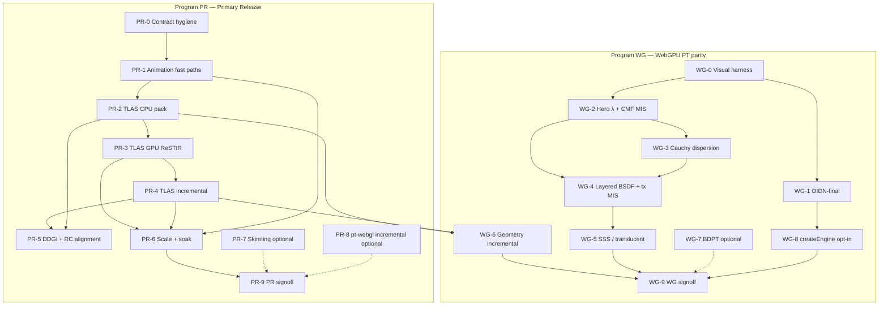

# Implementation Plan: Primary Release + WebGPU PT Parity (summary)

**Date:** 2026-05-26  
**Scope:** Deep pipeline work and backend maturity only (no npm publish, release governance, or cross-host verification policy).  
**Audience:** Implementation agents and human reviewers scheduling sprints.

> **Execution spec:** For byte-level layouts, per-shader migration tables, storage-buffer inventory, fork→WGSL mapping, and numbered micro-tasks with file manifests, use **[primary-release-and-webgpu-pt-parity-implementation-deep.md](./primary-release-and-webgpu-pt-parity-implementation-deep.md)** (~1300 lines). This file is the executive summary only.

**Related docs:**

- `plan/backend-maturity-matrix-2026-05-26.md` — current maturity snapshot
- `plan/backend-maturity-sweep-signoff-2026-05-26.md` — Wave 0–5 gate evidence
- `plan/renderer-fidelity-matrix.md` — feature-level pt-webgl vs pt-webgpu rows
- `plan/archive/gap-closure-acceptance-matrix.md` — deterministic capture scenarios
- `packages/shared-bvh/src/tlas.ts` — CPU TLAS foundation (shipped)
- `packages/pt-webgpu/src/scene/uploadSceneBuffers.ts` — reference BLAS+TLAS packer

---

## 0. Executive summary

Vitrum has **two programs**, not one:

| Program | Goal | Current | Target | Calendar (1 FTE, focused) |
|---------|------|---------|--------|---------------------------|
| **PR** — Primary release | `walkaround-hybrid` + `pt-webgl` + `@vitrum/engine` are production-intent for realtime GI + converged WebGL2 PT | ~85–92% pipeline depth | **PR-complete**: scale, animation ergonomics, TLAS in hybrid, truthfulness, soak | **12–16 weeks** |
| **WG** — WebGPU PT peer | `@vitrum/pt-webgpu` matches `@vitrum/pt-webgl` where the contract promises PT quality | ~55–65% feature parity | **WG-complete**: visual parity harness green, OIDN + spectral + BSDF/MIS aligned, opt-in facade | **+20–28 weeks** (overlaps PR after week 4) |

**Recommendation:** Run **PR** to signoff first (unblocks stainedGlass / hero apps). Run **WG** in parallel starting at **PR-2** (shared TLAS packer) and **WG-0** (visual harness), converging on shared `shared-bvh` + scene-pack code.

**Explicit non-goals (both programs):**

- Real-time caustics on `walkaround-hybrid` (`causticStrategy: 'none'` by design)
- Converged multi-bounce PT on walkaround (use `prefer: 'quality'` → pt-webgl)
- BMFR denoiser implementation (contract union only; no module in `shared-denoisers`)
- npm publish, semver policy, legal/licensing review

---

## 1. Program architecture



### Shared foundation (extract once, use twice)

| Module | Owner package | Consumers |
|--------|---------------|-----------|
| `buildSceneTlasPack()` — per-primitive local BLAS + concat + `primitiveTlasBindings` | **`@vitrum/shared-bvh`** (new `scenePack.ts`) | `walkaround-hybrid`, `pt-webgpu` (migrate off duplicate logic) |
| `traceTlasClosest` / `traceTlasAny` / `traceMeshBvh(root)` WGSL | **`@vitrum/shared-bvh/wgsl`** or `shared-samplers` | hybrid ReSTIR shaders, pt-webgpu (dedupe) |
| Visual capture adapter | **`tools/benchmark-runner`** | All parity scenarios |

**Rule:** No third copy of pt-webgpu `uploadSceneBuffers` concat logic in walkaround — hoist to `shared-bvh` in **PR-2**, then thin pt-webgpu to import it (**WG-6**).

---

## 2. Program PR — Primary release (realtime GI + WebGL2 PT)

### PR definition of done

All must be true:

| ID | Gate |
|----|------|
| PR-D1 | `npm run verify:mechanical` green |
| PR-D2 | `npm run hardening:wave4` green (strict lifecycle soak ≥ 8 iterations, 0 failures) |
| PR-D3 | Hybrid **TLAS path** default-on for scenes with ≥ 2 mesh primitives OR ≥ 1 `instanced-mesh`; merged BVH remains fallback behind `EngineOptions.extensions['vitrum.hybrid.bvhMode'] = 'merged'` |
| PR-D4 | `updatePrimitive` transform + positions + material + topology paths documented in `EngineCapabilities.incrementalPatchSupport` and match runtime |
| PR-D5 | `updateEmitter` uses emitter-buffer fast path (no full `setScene`) |
| PR-D6 | Reference captures: `tools/reference-renders/PR-hybrid-tlas-on`, `PR-hybrid-material-edit`, `PR-hybrid-200k-living-room` (hashes recorded in benchmark JSON) |
| PR-D7 | `plan/archive/animation-support-status.md` superseded by updated matrix in README + `packages/walkaround-hybrid/README.md` |
| PR-D8 | `packages/pt-webgl/README.md` stability wording matches root README (remove stale "Pre-alpha" if still present) |
| PR-D9 | `/audit` on each wave: no new god-files; pass registry unchanged in behavior |

---

### PR-0 — Contract hygiene & documentation truth (Week 1)

**Problem:** Hosts and agents rely on stale docs; fast paths do not sync `@vitrum/core` `Scene`; material path contradicts old AGENTS bullets.

| Task | Files / symbols | Work | Tests |
|------|-----------------|------|-------|
| PR-0.1 | `HybridEnginePrimitiveUpdates.ts`, `HybridEngine.ts` | After successful `transformRefit` / `positionsRefit` / `topologyRebuild`, patch `_lastScene` primitive fields (transform, positions, indices) from patch | `hybridEngineGeometryUpdate.test.ts`: assert `_lastScene` mesh positions match THREE mesh after refit |
| PR-0.2 | `HybridEngine.ts` `updateEmitter` | Route to `WalkaroundGPUPipeline.updateEmitters()` + `requestAccumReset()` instead of `setScene()` | New test: emitter intensity patch, assert pipeline-compile counter unchanged |
| PR-0.3 | `HybridEngine.ts` capabilities | Set `incrementalPatchSupport.emitter: true` after PR-0.2; keep `material: false` until PR-1.1 | `promiseLedger.test.ts` |
| PR-0.4 | `AGENTS.md`, `CLAUDE.md`, `plan/archive/animation-support-status.md` | Mark animation doc superseded; point to README capability matrix; fix "material-only fast path shipped" → accurate (PR-1.1 target) | Doc review only |
| PR-0.5 | `packages/pt-webgl/README.md` | Align stability section with root README ("release-candidate track") | — |

**Audit gate:** `/audit` on `HybridEngine.ts`, `HybridEnginePrimitiveUpdates.ts`.

**Exit:** PR-0.1–0.3 merged; ledger tests green.

---

### PR-1 — Animation & lighting ergonomics (Weeks 2–3)

**Problem:** Lighting designers need per-emitter and per-material edits without DDGI atlas teardown; mesh transform works but DDGI/RC pay full rebuild costs.

| Task | Files | Work | Acceptance |
|------|-------|------|------------|
| PR-1.1 | `HybridEngine.ts`, `WalkaroundGPUPipeline.ts`, materials upload path | **Material fast path:** re-upload single slot in materials texture + patch `bvhIndex.w` / beer colors if needed; `invalidateProbeCache` optional; **no** `_initPipeline()` | Playwright or unit: material color change visible ≤ 2 frames; `pipelineCompileCount` unchanged |
| PR-1.2 | `HybridEngine.ts` capabilities | `incrementalPatchSupport.material: true` | Ledger |
| PR-1.3 | `WalkaroundGPUPipeline.ts` `updateEmitters` | Public via `HybridEngine.updateEmitter` (PR-0.2); rebuild emitter SSBO from `_lastScene` | Emitter position patch updates ReSTIR without BVH rebuild |
| PR-1.4 | `three-bindings/solveSkin.ts` + docs | Document host contract: per frame `solveSkin(prim)` → `updatePrimitive(id, { positions, normals })` | Example snippet in `walkaround-hybrid/README.md` |
| PR-1.5 | `examples/hero-lighting-designer` | Wire debounced `updateEmitter` / `updatePrimitive` material (not `setScene`) | Manual smoke |

**Deferred within PR (explicit):** GPU compute skinning → **PR-7**.

**Audit gate:** `/audit` after PR-1.1 (watch `HybridEngine.ts` LOC).

---

### PR-2 — TLAS CPU scene pack (Weeks 4–6)

**Problem:** `buildReSTIRSceneBVH` → `buildSceneBVH` merges all meshes into one world-space tree (`restir/bvhCompute.ts`, `shared-bvh/bvhCommon.ts`). Large multi-mesh scenes pay refit hacks (`meshVertexRanges`, world position patches).

| Task | Files | Work | Acceptance |
|------|-------|------|------------|
| PR-2.1 | `shared-bvh/src/scenePack.ts` (new) | Extract from `pt-webgpu/scene/uploadSceneBuffers.ts`: per-primitive `buildArrayBvh` (local space), global node/tri/vertex concat, `TlasInstance[]`, `primitiveTlasBindings` | Unit: 2-mesh scene → `tlasIntersect` oracle matches merged-BVH hits for static poses |
| PR-2.2 | `shared-bvh/src/index.ts` | Export `buildSceneTlasPack`, `refitSceneTlasTransforms`, types | Typecheck |
| PR-2.3 | `walkaround-hybrid/restir/bvhCompute.ts` | `buildReSTIRSceneBVHTlas()` behind `bvhMode: 'tlas' \| 'merged'` (default `'tlas'` when instance count > 1) | Golden CPU buffers vs pt-webgpu packer for Cornell multi-box |
| PR-2.4 | `walkaround-hybrid` `SceneBVHBuffers` type | Extend with optional `tlas:*` GPU upload fields | Shape test `frameResourcesShape.test.ts` |
| PR-2.5 | `pt-webgpu/scene/uploadSceneBuffers.ts` | Thin wrapper importing `shared-bvh/scenePack` (no behavior change) | All existing pt-webgpu scene tests pass |

**Feature flag:** `HybridEngineOptions.extensions?.['vitrum.hybrid.bvhMode']` until PR-3 completes.

**Audit gate:** `/audit` on new `scenePack.ts` (target < 400 LOC; split helpers if larger).

---

### PR-3 — TLAS GPU traversal (ReSTIR + shade) (Weeks 7–11)

**Problem:** Hybrid WGSL uses `@vitrum/shared-bvh` `bvhIntersectFirstHit` always from node 0. pt-webgpu has `traceTlasClosest` / `traceMeshBvh(blasRoot)` in `wgsl/pathTrace/intersection.wgsl.ts`.

| Task | Files | Work | Acceptance |
|------|-------|------|------------|
| PR-3.1 | `shared-bvh/src/wgsl/tlasIntersect.wgsl.ts` (new) | Port `traceTlasClosest`, `traceTlasAny`, `traceMeshBvh` with `rootNode` param; keep 32-byte node layout | WGSL compose test in `walkaround-hybrid` wgsl registry |
| PR-3.2 | `walkaround-hybrid/shaders/common.wgsl.ts` | Inject TLAS module; add `traceSceneClosest` wrapper selecting merged vs TLAS via uniform `params.bvhMode` | — |
| PR-3.3 | `bindGroupLayouts.ts`, `bindGroupBuilders.ts` | Add bindings 6–10 (match pt-webgpu 24–28): `tlasNodes`, `tlasInstanceIndices`, `tlasBlasRoots`, `tlasW2L`, `tlasL2W` | Layout pin test |
| PR-3.4 | `ris.wgsl.ts`, `risGi.wgsl.ts`, `shade.wgsl.ts`, `spatial.wgsl.ts`, `temporal.wgsl.ts`, `restirCastPrimary.wgsl.ts`, `surfaceTextures.wgsl.ts` | Replace `bvhIntersect*` with `traceSceneClosest` / `traceSceneAny` | Existing ReSTIR unit tests + new GPU test `hybrid-tlas-primary-hit.gpu.test.ts` |
| PR-3.5 | `WalkaroundGPUPipeline.initialize` | Upload TLAS buffers when present | — |
| PR-3.6 | `tools/reference-renders/PR-hybrid-tlas-on` | Capture Cornell 2-mesh + living-room subset vs `merged` mode A/B | Visual diff documented |

**Risk:** Bind group limit on older WebGPU adapters — gate with `device.limits` test; fall back to merged mode.

**Audit gate:** `/audit` on shader call-site diff (no logic duplication in each pass file — use common wrapper only).

---

### PR-4 — TLAS incremental update paths (Weeks 12–13)

**Problem:** `transformRefit` rewrites world `bvhPositions` slices; should be TLAS `refitTlas` + optional BLAS refit.

| Task | Files | Work | Acceptance |
|------|-------|------|------------|
| PR-4.1 | `HybridEnginePrimitiveUpdates.ts` | `transformRefit`: update instance `localToWorld` / `worldToLocal` buffers; `refitSceneTlasTransforms()`; drop world-vertex rewrite when TLAS mode | CPU: moving box AABB updates; GPU: primary hit moves |
| PR-4.2 | `positionsRefit` | Local BLAS `refitBvhBounds` on primitive range + TLAS refit | Same tri count required; else `topologyRebuild` |
| PR-4.3 | `topologyRebuild` | Rebuild one primitive's local BLAS, patch concat region or full rebuild if instance count changes | Timing test: < 60 ms @ 30k tris |
| PR-4.4 | `refreshBvhRefit` / `refreshBvhFullRebuild` | Upload paths for TLAS + partial BLAS | — |

**Audit gate:** `/audit` on `HybridEnginePrimitiveUpdates.ts`.

---

### PR-5 — DDGI & RC subsystem alignment (Weeks 12–15, parallel PR-4)

**Problem:** Three merged BVHs today: ReSTIR, DDGI (`SceneBvh`), RC (`buildRCSceneBVH`).

| Task | Files | Work | Acceptance |
|------|-------|------|------------|
| PR-5.1 | `walkaround-hybrid/ddgi/SceneBvh.ts` | **Option A (recommended):** Share `buildSceneTlasPack` positions/normals for probe rays; DDGI traversal uses same BLAS buffers as ReSTIR (read-only) | DDGI probe update unchanged visually on Cornell |
| PR-5.2 | `probeUpdateRays.wgsl.ts` | If needed: `traceSceneClosest` for ray-gen | — |
| PR-5.3 | `HybridEngineRC.ts` | Transform-only: `refit` cascade AABB from TLAS bounds instead of `setScene` full rebuild | RC acceptance test metrics stable |
| PR-5.4 | `rcEnabled` scenes | Document: RC + TLAS moving instances — MIS weights unchanged | `plan/w8-rc-mis-composition.md` addendum |

**Fallback:** If DDGI merge is high risk, document **dual BVH** (ReSTIR TLAS + DDGI merged) in README and schedule PR-5.1 for PR-9.1 hotfix.

---

### PR-6 — Scale, performance & reliability soak (Weeks 14–16)

| Task | Work | Acceptance |
|------|------|------------|
| PR-6.1 | `examples/` or `tools/benchmark-runner` scenarios | Add `hybrid-200k-static`, `hybrid-tlas-10k-inst`, `hybrid-material-churn` | p95 frame time recorded in JSON |
| PR-6.2 | `run-lifecycle-soak.mjs` | Scenarios: material patch, emitter patch, `setSize`, tab visibility, TLAS on | 8 iterations, 0 failures strict mode |
| PR-6.3 | `README.md` performance table | Update with TLAS-on numbers | — |
| PR-6.4 | Memory | `debug.estimatedGpuMemoryBytes()` sanity on 200k scene | No OOM on 8 GB iGPU tier (document min spec) |

---

### PR-7 — Skinning polish (Optional, Weeks 14–17 parallel)

| Task | Work | Acceptance |
|------|------|------------|
| PR-7.1 | `shared-bvh` or `walkaround-hybrid` compute pass | WGSL LBS skinning: bones × morph → position/normal buffers | 1k verts < 0.5 ms GPU |
| PR-7.2 | Normals | Inverse-transpose for scaled bones | Test: non-uniform scale bone |
| PR-7.3 | `examples/hero-viewer` | Animated glTF skinned mesh | Visual |

**Not blocking PR-D*** if host uses CPU `solveSkin` path (PR-1.4).

---

### PR-8 — pt-webgl incremental paths (Optional, Weeks 15–18)

**Current:** `updatePrimitive` → `setScene` only (`ptEngineWebGL2.ts:856-859`). Ledger correctly marks all incremental flags `false`.

| Option | Work | When |
|--------|------|------|
| **8a — Document only** | README: "patches correct but rebuild" | Default if fork has no fast API |
| **8b — Fork transform patch** | Audit `three-gpu-pathtracer` for matrix-only update; wire transform-only | If fork supports < 5 ms rebuild |

**Not blocking PR signoff** unless product requires animated PT meshes without `setScene`.

---

### PR-9 — Primary release signoff (Week 16)

1. Run PR-D1–D9 checklist  
2. Update `plan/backend-maturity-matrix-2026-05-26.md` — hybrid `Deep pipeline integration` → **strong**  
3. Session summary in CHANGELOG `[Unreleased]`

---

## 3. Program WG — WebGPU PT replaces WebGL2

### WG definition of done

| ID | Gate |
|----|------|
| WG-D1 | All rows in `plan/renderer-fidelity-matrix.md` that apply to pt-webgl PT are **supported** or **experimental** (not **approximate** / **unsupported**) for pt-webgpu, with mechanical + runtime evidence |
| WG-D2 | `plan/archive/gap-closure-acceptance-matrix.md` scenarios **PASS** including `ptwgpu-parity-material-fields` |
| WG-D3 | `pt-webgpu` `denoiser: 'oidn-final'` executes (not warn-only) |
| WG-D4 | Hero-wavelength + CMF MIS matches fork within documented tolerance (see §3.6) |
| WG-D5 | `createEngine({ prefer: 'quality-webgpu' })` or `extensions.backend: 'pt-webgpu'` documented; **`auto` unchanged** until WG-D2 |
| WG-D6 | README experimental boundary updated: "feature parity with pt-webgl for contract surface X" |
| WG-D7 | No regressions in `npm run verify:mechanical` |

**Explicit WG non-goals (unless product requests):**

- Full walkaround denoiser stack on pt-webgpu (atrous, neural, svgf-real) — **WG-9 optional**
- BDPT on pt-webgpu (**WG-7**) — pt-webgl-only today; 6–8 week fork port

---

### WG-0 — Visual harness & baselines (Weeks 1–2, start immediately)

**Blocks all fidelity promotions.**

| Task | Files | Work | Acceptance |
|------|-------|------|------------|
| WG-0.1 | `tools/benchmark-runner/` | Scenario runner for pt-webgpu headless HDR readback (exists in `two-engines-one-scene`; generalize) | Produces PNG + SHA-256 |
| WG-0.2 | `tools/reference-renders/baseline/` | Seed baselines for 7 scenarios in gap-closure matrix | `gap-closure-verification-*.json` → PASS |
| WG-0.3 | `plan/renderer-fidelity-matrix.md` | Unblock "Runtime evidence" column template | — |
| WG-0.4 | CI | Document `VITRUM_GPU_CAPTURE=1` opt-in; default CI stays mechanical-only | — |

**Deliverable:** Any pt-webgpu change runs `npm run benchmark:gap-closure --workspace @vitrum/benchmark-runner` (add script).

---

### WG-1 — OIDN-final denoiser (Weeks 3–4)

**Parity target:** pt-webgl (`oidnFinalDispatcher.ts`), not walkaround full stack.

| Task | Files | Work | Acceptance |
|------|-------|------|------------|
| WG-1.1 | `pt-webgpu/src/denoise/` (new) | Port readback pattern from `pt-webgl/readbackHdr.ts` | Unit: mock ONNX bridge |
| WG-1.2 | `pt-webgpu/src/index.ts` | Remove warn-only branch; dispatch OIDN when `denoiser === 'oidn-final'` | Integration test |
| WG-1.3 | Aux buffers | Feed `normalDepth`, `albedo`, `variance`, `motionVectors` into OIDN pack | Scenario hash stable |
| WG-1.4 | `factory.ts` / capabilities | Document `supportedDenoisers: ['none', 'oidn-final']` on pt-webgpu | Ledger update |

---

### WG-2 — Hero-wavelength & CMF MIS (Weeks 5–10)

**Largest WG slice.**

| Task | Files | Work | Acceptance |
|------|-------|------|------------|
| WG-2.1 | `shared-samplers` | Export WGSL strings for `sampleHeroWavelengthMIS`, CMF CDFs (mirror `forkUniformBridge`) | Existing 15 MIS tests remain green |
| WG-2.2 | `pt-webgpu/wgsl/pathTrace/kernel.wgsl.ts` | Replace RGB 630/540/460 thin-film probes with hero λ sample + MIS pdf | `rfe08-13-spectral-payload` PASS |
| WG-2.3 | `material.wgsl.ts` | Per-λ `thinFilmTmmRt(matId, lambda, ...)` | `rfe14-thinfilm-angle-shift` PASS |
| WG-2.4 | `scene/materialPacking.ts` | Verify 32-bin spectral grid consumed in shader | `scenePack.materials.test.ts` extended |
| WG-2.5 | CPU oracle | Extend `cpuTracer.ts` for hero λ path | MC convergence within 5% |

**Tolerance (document in fidelity matrix):** Mean RGB Δ < 3% vs pt-webgl @ 512 SPP on `rfe08` scene.

---

### WG-3 — Cauchy dispersion (Weeks 11–12)

| Task | Work | Acceptance |
|------|------|------------|
| WG-3.1 | `materialPacking.ts` | Pack `vitrumDispersionAbbeNumber` equivalent | — |
| WG-3.2 | `material.wgsl.ts` | IOR(λ) Cauchy bridge | Renderer matrix row → **experimental** minimum |

---

### WG-4 — Layered BSDF + transmission MIS (Weeks 11–14, overlaps WG-3)

| Task | Files | Work | Acceptance |
|------|-------|------|------------|
| WG-4.1 | `bsdf.wgsl.ts` | Align `sampleNextBounceDirection` / PDF with fork layered front/back | `rfe03-layered-front-back` PASS |
| WG-4.2 | `bsdf.wgsl.ts` | Fix `brdfDirectionalPdf` transmission branch (README "simplified") | Energy test in `energyConservation.test.ts` |
| WG-4.3 | `shared-samplers/wgsl/bsdfPrimitives` | Dedupe if not already (post W2-C6) | — |

---

### WG-5 — SSS / translucent gating (Weeks 15–17)

| Task | Work | Acceptance |
|------|------|------------|
| WG-5.1 | Material flags | Map `TRANSLUCENT_BIT` equivalent in packed material | — |
| WG-5.2 | `kernel.wgsl.ts` | Replace simplified σₐ/σₛ with fork-equivalent gating | `rfe07-11-sss-mixed-panels` PASS |

---

### WG-6 — Geometry incremental & TLAS (Weeks 12–16)

**Depends on PR-2 / PR-4** (shared scene pack).

| Task | Work | Acceptance |
|------|------|------------|
| WG-6.1 | `pt-webgpu/index.ts` `updatePrimitive` | `positions` fast path: BLAS refit + TLAS refit (not full `setScene`) | `updatePrimitiveIncremental.test.ts` extended |
| WG-6.2 | Topology | Rebuild single primitive BLAS in packer | — |
| WG-6.3 | `tlasPromotionAcceptance.test.ts` | Default-on metrics | — |

---

### WG-7 — BDPT (Optional, Weeks 18–26)

Only if product requires parity with `pt-webgl` `extensions['vitrum.ptWebgl.bdpt']`.

| Task | Work |
|------|------|
| WG-7.1 | Port BDPT connection MIS from fork / `shared-samplers` |
| WG-7.2 | WGSL dispatch paths + uniform budgets |
| WG-7.3 | Scenario + baseline capture |

**Defer** until WG-D2 without BDPT unless stainedGlass PT mode requires it.

---

### WG-8 — createEngine opt-in (Week 17, after WG-1 + WG-0 green)

| Task | Files | Work |
|------|-------|------|
| WG-8.1 | `createEngineScale.ts` | Add `'quality-webgpu'` OR `options.extensions?.backend === 'pt-webgpu'` |
| WG-8.2 | `createEngine.ts` | Construct `createPTEngine_WebGPU` when selected |
| WG-8.3 | `engine/__tests__` | Matrix test: quality-webgpu picks pt-webgpu |
| WG-8.4 | `README.md` | Document explicit opt-in; **auto** still walkaround / pt-webgl |

---

### WG-9 — Extended denoisers (Optional)

Wire `@vitrum/shared-denoisers` à-trous / svgf-real using existing aux buffers — **walkaround-class**, not pt-webgl parity. Schedule only if product wants single WebGPU PT + denoise without hybrid.

---

### WG-10 — WebGPU PT signoff (Week 28 target)

1. WG-D1–D7  
2. Side-by-side captures: Cornell glass, spectral, thin-film, layered BSDF  
3. Update `packages/pt-webgpu/README.md` — remove "no denoiser" / "RGB probes" from limitations  
4. Update backend maturity matrix: pt-webgpu → **strong** on deep pipeline integration

---

## 4. Cross-program dependency table

| PR task | Unblocks WG task | Notes |
|---------|------------------|-------|
| PR-2 scene pack | WG-6 | Single implementation |
| PR-3 TLAS WGSL | WG-6 traversal | shared-bvh module |
| PR-0 emitter fast path | — | Host UX only |
| WG-0 harness | PR-6.1 captures | Shared benchmark-runner |
| WG-2 spectral | — | Independent of hybrid |
| PR-5 DDGI | — | Hybrid only |

**Critical path (longest pole):** PR-2 → PR-3 → PR-4 → PR-6 **and** WG-0 → WG-2 → WG-4 → WG-10.

---

## 5. Testing strategy (both programs)

### Mechanical (every PR/WG wave)

```bash
npm run verify:mechanical
npm run typecheck --workspace @vitrum/benchmark-runner
npm test --workspace @vitrum/benchmark-runner
```

### Targeted package tests

| Area | Command |
|------|---------|
| TLAS CPU | `npm test --workspace @vitrum/shared-bvh` |
| Hybrid incremental | `npm test --workspace @vitrum/walkaround-hybrid` |
| pt-webgpu contract | `npm test --workspace @vitrum/pt-webgpu` |
| Engine facade | `npm test --workspace @vitrum/engine` |

### GPU-opt-in

```bash
VITRUM_GPU_CAPTURE=1 npm test --workspace @vitrum/pt-webgpu -- --config vitest.gpu.config.ts
```

Add hybrid TLAS GPU test behind same flag.

### Visual / parity

| Scenario ID | Program |
|-------------|---------|
| `PR-hybrid-tlas-on` | PR |
| `PR-hybrid-material-edit` | PR |
| `ptwgpu-parity-material-fields` | WG |
| `rfe03-layered-front-back` | WG |
| `rfe07-11-sss-mixed-panels` | WG |
| `rfe08-13-spectral-payload` | WG |
| `rfe14-thinfilm-angle-shift` | WG |

**Promotion rule:** No matrix row → `supported` without hash + PASS in JSON artifact.

### Audit checkpoints (mandatory)

After **each** of PR-0, PR-1, PR-2, PR-3, PR-4, PR-5, PR-6, WG-0, WG-1, WG-2, WG-4, WG-10:

- Run `/audit` on changed packages
- Fix god-files / export sprawl before next wave
- Do not grow `HybridEngine.ts` past ~1400 LOC — extract coordinators

---

## 6. Error handling & degradation

| Failure | Behavior |
|---------|----------|
| TLAS build empty instances | Fall back to merged BVH; `console.warn` once |
| WebGPU storage buffer limit | `capabilities` reports `maxStorageBuffersPerShaderStage`; hybrid auto-fallback `bvhMode: 'merged'` |
| OIDN model load fail | pt-webgpu: throw at init with remediation URL; pt-webgl: same |
| `updatePrimitive` topology unsupported | Throw with `setScene` hint (existing) |
| Skinning without solveSkin | Throw from `sceneFromThreeJS` or doc-only warn |

---

## 7. Resource & timeline estimates

### Single full-time implementer (sequential)

| Program | Weeks | Person-weeks |
|---------|-------|--------------|
| PR | 16 | ~14 (PR-7/8 optional) |
| WG | 28 | ~24 (WG-7/9 optional) |
| **Combined calendar** | **~30–32** | With PR-2+ and WG-0+ in parallel from week 4 |

### Two implementers (recommended split)

| Owner | Tracks |
|-------|--------|
| **A — Hybrid / shared-bvh** | PR-0 → PR-6, PR-5, shared scene pack |
| **B — pt-webgpu** | WG-0 → WG-6, WG-8, WG-10 |

Merge point: **week 4** on `shared-bvh/scenePack.ts` (PR-2.1 / WG-6 prep).

### Milestone calendar (2 FTE)

| Week | A (Hybrid) | B (pt-webgpu) |
|------|------------|---------------|
| 1 | PR-0 | WG-0 |
| 2–3 | PR-1 | WG-0 baselines |
| 4–6 | PR-2, PR-3 start | WG-1 OIDN |
| 7–11 | PR-3, PR-4 | WG-2 spectral |
| 12–15 | PR-5, PR-6 | WG-4, WG-5 |
| 16 | **PR signoff** | WG-6 |
| 17–22 | PR-7 optional, support B | WG-3, WG-4 finish |
| 23–28 | — | WG-8, WG-10 |

---

## 8. Risk register

| Risk | Likelihood | Impact | Mitigation |
|------|------------|--------|------------|
| DDGI TLAS sharing breaks probe convergence | Medium | High | PR-5 fallback dual-BVH; A/B probe atlas |
| Bind group exhaustion on hybrid | Low | High | Merged fallback; test Intel iGPU |
| Spectral parity elusive (RGB vs hero λ) | Medium | Medium | Document tolerance; CPU oracle first |
| Fork BDPT port scope creep | High | Medium | WG-7 explicit defer |
| Agent brief stale (NOT IN HEAD) | Medium | Low | PR-0.4 doc pass |
| Performance regression TLAS vs merged | Medium | Medium | PR-6.1 benchmarks; keep merged flag |

---

## 9. Work breakdown checklist (no gaps)

Use this as the sprint backlog source of truth. Every item must land or be explicitly deferred with owner sign-off.

### Program PR (42 items)

- [ ] PR-0.1 `_lastScene` sync on fast paths
- [ ] PR-0.2 `updateEmitter` → `updateEmitters`
- [ ] PR-0.3 capabilities emitter true
- [ ] PR-0.4 docs supersede animation-status
- [ ] PR-0.5 pt-webgl README stability
- [ ] PR-1.1 material GPU fast path
- [ ] PR-1.2 capabilities material true
- [ ] PR-1.3 emitter buffer path tested
- [ ] PR-1.4 skinning host contract doc
- [ ] PR-1.5 hero-lighting-designer wiring
- [ ] PR-2.1 `shared-bvh/scenePack.ts`
- [ ] PR-2.2 exports
- [ ] PR-2.3 `buildReSTIRSceneBVHTlas`
- [ ] PR-2.4 `SceneBVHBuffers` extend
- [ ] PR-2.5 pt-webgpu thin wrapper
- [ ] PR-3.1 TLAS WGSL module
- [ ] PR-3.2 common.wgsl wrapper
- [ ] PR-3.3 bind groups 6–10
- [ ] PR-3.4 all ReSTIR shader migrations
- [ ] PR-3.5 pipeline upload
- [ ] PR-3.6 reference capture TLAS on
- [ ] PR-4.1 transform TLAS refit
- [ ] PR-4.2 positions BLAS refit
- [ ] PR-4.3 topology rebuild
- [ ] PR-4.4 refresh upload paths
- [ ] PR-5.1 DDGI shared pack
- [ ] PR-5.2 probe rays traversal
- [ ] PR-5.3 RC refit API
- [ ] PR-5.4 RC docs
- [ ] PR-6.1 benchmark scenarios
- [ ] PR-6.2 lifecycle soak expansion
- [ ] PR-6.3 README perf table
- [ ] PR-6.4 memory sanity
- [ ] PR-7.1 GPU skinning (optional)
- [ ] PR-7.2 inverse-transpose (optional)
- [ ] PR-7.3 hero glTF (optional)
- [ ] PR-8a or PR-8b pt-webgl incremental (optional)
- [ ] PR-D1–D9 signoff gates

### Program WG (38 items)

- [x] WG-0.1 benchmark runner pt-webgpu capture (`capturePtWebgpu.mjs`, lite tier on SwiftShader)
- [ ] WG-0.2 baseline PNGs (7 scenarios) — `ptwgpu-parity-material-fields.png` seeded; 6 remaining
- [ ] WG-0.3 fidelity matrix columns
- [ ] WG-0.4 CI docs
- [ ] WG-1.1 denoise module
- [ ] WG-1.2 remove warn-only
- [ ] WG-1.3 aux → OIDN
- [ ] WG-1.4 capabilities denoisers
- [ ] WG-2.1 shared WGSL MIS
- [ ] WG-2.2 kernel hero λ
- [ ] WG-2.3 material TMM per λ
- [ ] WG-2.4 packing verify
- [ ] WG-2.5 cpuTracer extend
- [ ] WG-3.1 Cauchy pack
- [ ] WG-3.2 Cauchy WGSL
- [ ] WG-4.1 layered BSDF
- [ ] WG-4.2 transmission MIS
- [ ] WG-4.3 bsdf dedupe
- [ ] WG-5.1 translucent bit
- [ ] WG-5.2 SSS gating
- [ ] WG-6.1 positions fast path
- [ ] WG-6.2 topology rebuild
- [ ] WG-6.3 TLAS acceptance
- [ ] WG-7 BDPT (optional)
- [ ] WG-8.1–8.4 createEngine opt-in
- [ ] WG-9 extended denoisers (optional)
- [ ] WG-D1–D7 signoff gates

---

## 10. Decision log (pre-locked; change only via user)

| Decision | Choice | Rationale |
|----------|--------|-----------|
| Hybrid TLAS default | On when instances > 1 | Matches product scale story |
| pt-webgpu in `auto` | **No** until WG-D2 | Avoid silent quality regression |
| Denoiser parity scope | OIDN-first on pt-webgpu | Matches pt-webgl |
| DDGI BVH strategy | Shared TLAS (Option A) | One truth; fallback documented |
| BDPT on pt-webgpu | Deferred (WG-7 optional) | Multi-week; not in walkaround |
| Material fast path before TLAS | Yes (PR-1) | Unblocks lighting designer UX now |

---

## 11. First sprint slice (if starting tomorrow)

**Week 1 sprint (parallel):**

1. PR-0.1 + PR-0.2 + PR-0.3 (hybrid contract hygiene)  
2. WG-0.1 + WG-0.2 (baseline harness — unblocks all WG)  
3. PR-1.1 start (material fast path)  

**Commands at end of week 1:**

```bash
npm run verify:mechanical
npm test --workspace @vitrum/walkaround-hybrid
# WG-0: first baseline hash committed under tools/reference-renders/baseline/
```

---

*End of plan. Revise this file when scope changes; do not duplicate into AGENTS.md until PR-D9 / WG-D7 complete.*
